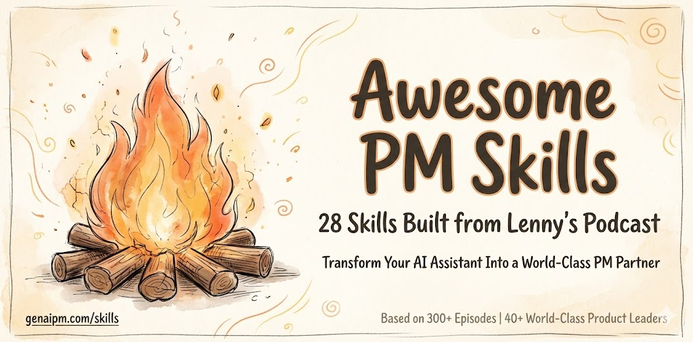

# Awesome PM Skills

> The most domain specific PM Builder skills for the whole product management lifecycle

**Based on [lennys-podcast-transcripts](https://github.com/ChatPRD/lennys-podcast-transcripts)**  
**Built by [Udi Menkes](https://linkedin.com/in/udimenkes)** | [𝕏](https://x.com/menkesu) | [GenAI PM](https://genaipm.com)

⭐ Star this repo to stay updated

---

## 📻 The Lenny Collection

**28 AI-powered skills built from Lenny's podcast transcripts** by [Lenny Rachitsky](https://twitter.com/lennysan)

Featuring wisdom from 300+ episodes with Brian Chesky (Airbnb), Shreyas Doshi (Stripe/Twitter), Kevin Weil (OpenAI CPO), Dylan Field (Figma), Marty Cagan (SVPG), and 40+ world-class PMs.

**Transform your AI coding assistant into a world-class product management partner.**

---

## 🎯 What Are Awesome PM Skills?

**Active, actionable skills** that Claude Code and Cursor use in real-time while you build products. Not "read and learn" content—these are **embedded frameworks** that guide AI through:

- 🏗️ Building products end-to-end (idea → prototype → launch)
- 🎯 Making strategic product decisions
- 📢 Communicating effectively with stakeholders
- 🤝 Navigating organizational politics
- 👥 Leading teams and growing your career

---

## 🚀 The Lenny Collection (28 Skills)

### 🏗️ BUILDER MODE (11 Skills)
*For: Prototyping, shipping, and measuring products*

[](zero-to-launch/SKILL.md)
[](strategic-build/SKILL.md)
[](continuous-discovery/SKILL.md)
[](design-first-dev/SKILL.md)

[](ai-product-patterns/SKILL.md)
[](ai-startup-building/SKILL.md)
[](jtbd-building/SKILL.md)
[](growth-embedded/SKILL.md)

[](exp-driven-dev/SKILL.md)
[](quality-speed/SKILL.md)
[](ship-decisions/SKILL.md)

1. **`zero-to-launch`** - Idea → Prototype playbook (OpenAI, Figma, Airbnb)
2. **`strategic-build`** - LNO framework, strategic vs tactical (Shreyas, Marty Cagan)
3. **`continuous-discovery`** - Weekly customer contact, opportunity solution trees (Teresa Torres)
4. **`design-first-dev`** - Craft quality standards (Brian Chesky, Dylan Field)
5. **`ai-product-patterns`** - AI-native development (Kevin Weil, OpenAI)
6. **`ai-startup-building`** - AI startup playbook (Dan Shipper, Brandon Chu)
7. **`jtbd-building`** - Jobs-to-be-Done design (Bob Moesta)
8. **`growth-embedded`** - Growth loops and viral mechanics (YC, Elena Verna)
9. **`exp-driven-dev`** - A/B testing and experimentation (Ronny Kohavi, Netflix)
10. **`quality-speed`** - Balancing craft vs velocity (Dylan Field, Brian Chesky)
11. **`ship-decisions`** - When to ship vs iterate (Shreyas, Marty, Tobi)

---

### 📢 COMMUNICATOR MODE (4 Skills)
*For: Storytelling, writing, presenting, positioning*

[](strategic-storytelling/SKILL.md)
[](positioning-craft/SKILL.md)
[](exec-comms/SKILL.md)
[](confident-speaking/SKILL.md)

12. **`strategic-storytelling`** - Product narratives (Andy Raskin, Nancy Duarte)
13. **`positioning-craft`** - Product positioning (April Dunford)
14. **`exec-comms`** - Executive memos (Amazon 6-pager, Stripe format)
15. **`confident-speaking`** - Presentations and pitches (Matt Abrahams)

---

### 🎯 STRATEGIST MODE (4 Skills)
*For: Decisions, prioritization, strategy, OKRs*

[](decision-frameworks/SKILL.md)
[](strategy-frameworks/SKILL.md)
[](okr-frameworks/SKILL.md)
[](prioritization-craft/SKILL.md)

16. **`decision-frameworks`** - Structured decisions (Annie Duke, Ben Horowitz)
17. **`strategy-frameworks`** - Product strategy (Crossing the Chasm, Playing to Win)
18. **`okr-frameworks`** - Goal setting (Christina Wodtke, Google OKRs)
19. **`prioritization-craft`** - Feature prioritization (Shreyas, RICE framework)

---

### 🤝 NAVIGATOR MODE (3 Skills)
*For: Influence, stakeholders, politics, getting things done*

[](influence-craft/SKILL.md)
[](stakeholder-craft/SKILL.md)
[](workplace-navigation/SKILL.md)

20. **`influence-craft`** - Power and influence (Jeffrey Pfeffer)
21. **`stakeholder-craft`** - Feedback and relationships (Kim Scott, Carole Robin)
22. **`workplace-navigation`** - Difficult colleagues (Anneka Gupta)

---

### 👥 LEADER MODE (3 Skills)
*For: Team building, culture, career growth*

[](culture-craft/SKILL.md)
[](career-growth/SKILL.md)
[](strategic-pm/SKILL.md)

23. **`culture-craft`** - Building excellence (David Singleton - Stripe, Dharmesh Shah)
24. **`career-growth`** - PM career advancement (Ami Vora, 40+ career episodes)
25. **`strategic-pm`** - Becoming strategic (Anneka Gupta)

---

### 📊 MEASUREMENT MODE (2 Skills)
*For: Metrics, experiments, feedback*

[](metrics-frameworks/SKILL.md)
[](user-feedback-system/SKILL.md)

26. **`metrics-frameworks`** - North Star, AARRR (Lenny's frameworks, Meta)
27. **`user-feedback-system`** - PMF measurement (Superhuman, YC)

---

### 🚀 LAUNCH MODE (1 Skill)
*For: Go-to-market and launch execution*

[](launch-execution/SKILL.md)

28. **`launch-execution`** - Go-to-market (April Dunford, Brian Chesky)

---

## 💡 How to Use These Skills

### Finding the Right Skills for Your Needs:

**Simply tell your AI assistant what you're working on, and it will activate the relevant skills:**

```
"I'm starting a new AI feature"
→ zero-to-launch, continuous-discovery, ai-product-patterns, strategic-build

"I need to present to executives"
→ exec-comms, strategic-storytelling, confident-speaking

"I'm prioritizing our roadmap"
→ prioritization-craft, decision-frameworks, strategy-frameworks

"I'm measuring product-market fit"
→ user-feedback-system, continuous-discovery, metrics-frameworks, exp-driven-dev

"I'm dealing with difficult stakeholders"
→ stakeholder-craft, influence-craft, workplace-navigation

"I'm launching a new product"
→ launch-execution, positioning-craft, growth-embedded

"I need to grow my PM career"
→ career-growth, strategic-pm, influence-craft
```

### In Cursor or Claude Code:

```
"Help me build a dashboard for customer feedback"

→ Claude activates:
   • zero-to-launch (MVP scoping)
   • design-first-dev (craft standards)
   • ai-product-patterns (AI features)
   • metrics-frameworks (what to track)
```

### Skills Work Together:

```
Building → strategic-build (is this Leverage work?)
         ↓
         design-first-dev (craft level needed?)
         ↓
         ship-decisions (ready to ship?)
         ↓
         launch-execution (how to announce?)
```

---

## 🏆 What Makes These Special

### 1. **Based on 300+ Episodes, 783K+ Views**

Top guests by viewership:
- Brian Chesky (Airbnb) - 381K views
- Shreyas Doshi (Stripe, Twitter, Google) - 260K views
- Marty Cagan (Silicon Valley Product Group) - 226K views
- Kevin Weil (OpenAI CPO) - 202K views
- Dylan Field (Figma) - 199K views
- Jeffrey Pfeffer (Stanford Power Expert) - 161K views
- Teresa Torres (Continuous Discovery) - Product Talk

### 2. **Active, Not Passive**

❌ Traditional: "Read this article about prioritization"
✅ These Skills: "Claude applies RICE framework while you code"

### 3. **Real Frameworks, Not Generic Advice**

Each skill includes:
- Specific frameworks (LNO, RICE, Jobs-to-be-Done, etc.)
- Decision trees (when to apply which framework)
- Code examples (for builder skills)
- Templates (for communication skills)
- Real-world examples (from top companies)

### 4. **Built for AI Builders**

Perfect for PMs who:
- Use Cursor or Claude Code to build prototypes
- Want to move fast with product thinking
- Need strategic guidance while coding
- Want soft skills + hard skills together

---

## 📚 Skill Categories Explained

### Builder Mode Skills
When building features, these skills help you:
- Scope MVP correctly (zero-to-launch)
- Make strategic build decisions (strategic-build)
- Discover customer needs weekly (continuous-discovery)
- Apply craft standards (design-first-dev)
- Integrate AI intelligently (ai-product-patterns)
- Build growth loops (growth-embedded)
- Ship with confidence (ship-decisions)

### Communicator Mode Skills
When presenting, writing, or positioning:
- Craft compelling narratives (strategic-storytelling)
- Position products effectively (positioning-craft)
- Write executive memos (exec-comms)
- Present with confidence (confident-speaking)

### Strategist Mode Skills
When making decisions and setting direction:
- Make better decisions (decision-frameworks)
- Create product strategy (strategy-frameworks)
- Set goals effectively (okr-frameworks)
- Prioritize ruthlessly (prioritization-craft)

### Navigator Mode Skills
When dealing with people and politics:
- Build influence (influence-craft)
- Manage stakeholders (stakeholder-craft)
- Handle difficult colleagues (workplace-navigation)

### Leader Mode Skills
When building teams and advancing your career:
- Build culture (culture-craft)
- Grow your career (career-growth)
- Become more strategic (strategic-pm)

---

## 🎯 Getting Started

### For New Users:

1. **Start with Wave 1 (Core Builder Skills):**
   - `zero-to-launch` - For starting any new feature
   - `strategic-build` - For deciding what to build
   - `continuous-discovery` - For weekly customer contact
   - `design-first-dev` - For craft quality
   - `ship-decisions` - For shipping with confidence

2. **Add Communication Skills:**
   - `positioning-craft` - For launching
   - `exec-comms` - For stakeholder updates

3. **Explore Based on Your Needs:**
   - Need to prioritize? → `prioritization-craft`
   - Need buy-in? → `influence-craft`
   - Building with AI? → `ai-product-patterns`

### For Experienced PMs:

Jump straight to advanced skills:
- **Strategic thinking:** `strategy-frameworks`, `strategic-pm`
- **AI building:** `ai-product-patterns`, `ai-startup-building`
- **Growth:** `growth-embedded`, `metrics-frameworks`
- **Leadership:** `culture-craft`, `influence-craft`

---

## 🌟 Real-World Impact

These skills embed wisdom from companies like:

- **Airbnb:** Design-led development, complete experience thinking
- **OpenAI:** AI-first product development, evals as specs
- **Figma:** Craft quality, simplicity forcing function
- **Stripe:** Operating principles, culture building
- **Netflix:** Experimentation culture, strong opinions weakly held
- **Meta:** Growth frameworks, viral mechanics
- **YC:** Startup playbook, talk to users

---

## 📖 Skill Deep Dives

Each skill includes:

1. **When This Skill Activates** - Trigger conditions for Claude
2. **Core Frameworks** - 3-5 key mental models
3. **Decision Trees** - When to apply which framework
4. **Action Templates** - Ready-to-use formats
5. **Quick Reference Cards** - At-a-glance checklists
6. **Real-World Examples** - From top companies
7. **Common Pitfalls** - What to avoid
8. **Key Quotes** - Wisdom from guests
9. **Related Skills** - What to use next

---

## 🤝 Contributing

These skills are based on publicly available content from Lenny's Podcast. The transcripts are from [ChatPRD/lennys-podcast-transcripts](https://github.com/ChatPRD/lennys-podcast-transcripts).

### Guest Attribution

Every skill credits its source guests:
- 381K views: Brian Chesky (Airbnb)
- 260K views: Shreyas Doshi (Stripe, Twitter, Google)
- 226K views: Marty Cagan (SVPG)
- 202K views: Kevin Weil (OpenAI)
- 199K views: Dylan Field (Figma)
- 161K views: Jeffrey Pfeffer (Stanford)
- Plus 40+ more incredible PM leaders

---

## 🔮 Future Roadmap

**Next Wave of Skills:**
- Technical PM skills (APIs, data models, system design)
- Pricing & monetization frameworks
- International expansion playbooks
- Crisis management patterns
- Zero-to-one product creation

**Community Additions:**
- Submit your own skill based on Lenny episodes
- Share "skill stacks" for specific products
- Showcase projects built with skills

---

## 👨‍💻 About the Creator

**[Udi Menkes](https://linkedin.com/in/udimenkes)** | AI Product Leader at Intuit  
🌐 [genaipm.com](https://genaipm.com) | 𝕏 [@menkesu](https://x.com/menkesu)

Udi Menkes is an AI Product Leader at Intuit, working on innovative AI products and Intuit's financial Language models. He also runs [genaipm.com](https://genaipm.com) - an AI Product Management Agent that curates insights and use cases for AI Product Managers from X, LinkedIn, YouTube, Websites, Arxiv and more and shares a daily/weekly brief with 5000+ product managers across 3000+ companies including all the largest and AI-first companies in the world.

---

## 🙏 Acknowledgments

**This project would not exist without:**

### 🎙️ Lenny's Podcast
- **[Lenny Rachitsky](https://twitter.com/lennysan)** - For creating an incredible podcast and generously sharing 300+ episodes of PM wisdom
- **Listen at:** [lennyspodcast.com](https://www.lennyspodcast.com/)
- **Subscribe:** Available on all podcast platforms

### 📝 Transcripts
- **[ChatPRD Team](https://github.com/ChatPRD)** - For the amazing work transcribing all episodes
- **Repository:** [ChatPRD/lennys-podcast-transcripts](https://github.com/ChatPRD/lennys-podcast-transcripts)

### 🌟 Podcast Guests
Massive credit to **300+ world-class guests** who shared their wisdom:
- **Brian Chesky** (Airbnb), **Shreyas Doshi** (Stripe/Twitter/Google), **Marty Cagan** (SVPG)
- **Kevin Weil** (OpenAI), **Dylan Field** (Figma), **Jeffrey Pfeffer** (Stanford)
- And 40+ more incredible PM leaders who made this possible

**All frameworks and insights are credited to their original creators. This project simply makes their wisdom more accessible to AI coding assistants.**

---

## 📜 License

These skills are based on publicly available podcast content. All framework credits go to the original creators and guests on Lenny's Podcast.

Built with 💙 by Udi Menkes (AI Product Leader, Intuit)

For the PM community, from the PM community.

---

## 🚀 Get Started Now

1. Clone this repo into your Cursor/Claude Code workspace
2. Skills auto-activate based on your context
3. Start building with world-class PM guidance

```bash
git clone [your-repo-url]
cd skills/lenny-pm-skills
# Skills are now available in your AI assistant
```

---

**Ready to build the most powerful AI PM products ever?**

**Let's go. 🚀**

