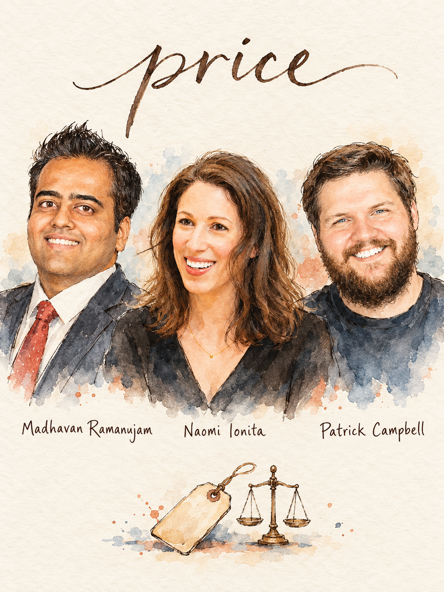
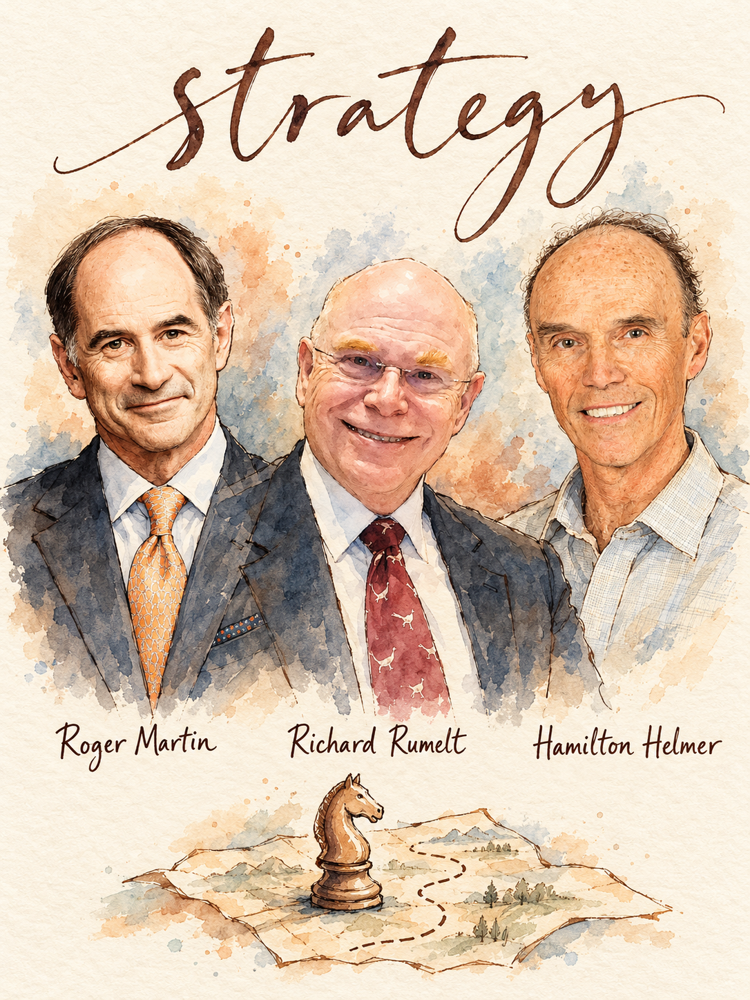
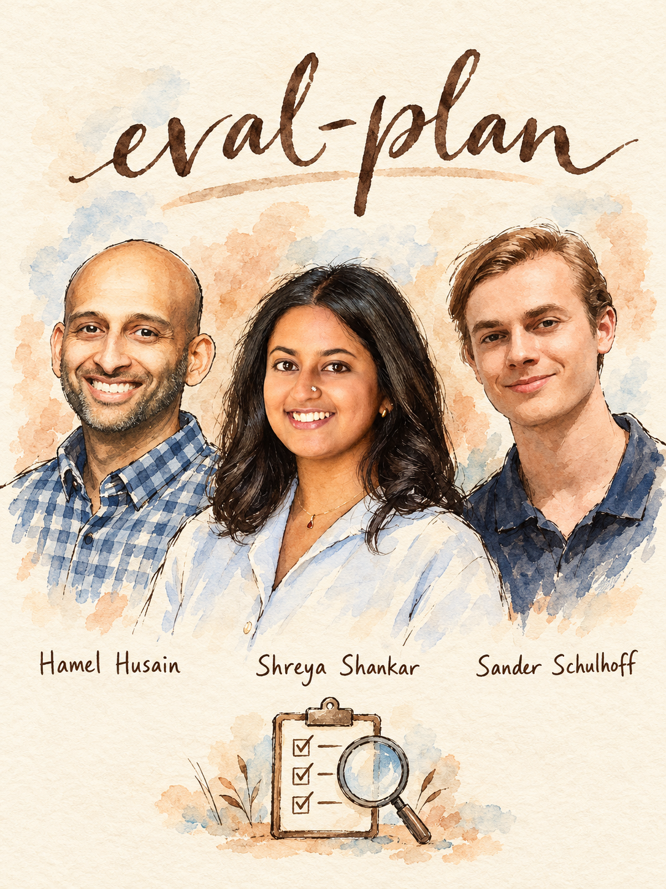

# Awesome PM Skills 2.0

**25 product management workflows built from 340 episodes of [Lenny’s Podcast](https://www.lennyspodcast.com/).**

Bring a pricing page, PRD, interview notes, survey export, or roadmap. Get a usable deliverable: a pricing plan, shaped spec, research synthesis, experiment brief, or decision memo. Each skill diagnoses your situation, picks a framework, works through it, and can grade what you already have.

Built by [Udi Menkes](https://linkedin.com/in/udimenkes) · [𝕏](https://x.com/menkesu) · [GenAI PM](https://genaipm.com)

<p align="center">
  <a href="skills/price/SKILL.md"></a>
  <a href="skills/strategy/SKILL.md"></a>
  <a href="skills/eval-plan/SKILL.md"></a>
</p>

[All 25 skills](#the-25-skills) · [Quickstart](QUICKSTART.md) · [Card gallery](images/README.md) · [Upgrading from v1](docs/MIGRATION.md) · [Contributing](CONTRIBUTING.md)

## Start with the work in front of you

| Bring this | Use this | Ask for this |
|---|---|---|
| A pricing page or plan matrix | [price](skills/price/SKILL.md) | Rework our packaging and design a willingness-to-pay test. |
| A PRD or rough feature idea | [spec](skills/spec/SKILL.md) | Turn this into a shaped spec, then grade it. |
| Interview notes | [customer-interviews](skills/customer-interviews/SKILL.md) | Identify customer forces and opportunities, with evidence. |
| An AI feature and sample outputs | [eval-plan](skills/eval-plan/SKILL.md) | Build an eval plan from the errors in these outputs. |
| A roadmap with too many priorities | [prioritize](skills/prioritize/SKILL.md) | Score confidence, surface tradeoffs, and propose a sequence. |
| A difficult decision | [decide](skills/decide/SKILL.md) | Write a decision memo with a pre-mortem and next actions. |

The assistant reads what you provide, asks up to four questions for missing context, and works toward the deliverable. Give it your stage, customer, goal, and constraints when you can.

## Install

### Claude Code plugin

Run these commands inside Claude Code:

```text
/plugin marketplace add menkesu/awesome-pm-skills
/plugin install awesome-pm-skills@awesome-pm-skills
```

Then invoke a skill by its plugin name:

```text
/awesome-pm-skills:price
Here’s our pricing page. Grade it and propose three improvements.
```

The plugin contains the 25 skills under `skills/`. It needs no API key, external service, or additional runtime to read its instructions. Your assistant supplies the model and any tools it uses to work with your files. See [Claude Code’s plugin documentation](https://code.claude.com/docs/en/plugins).

### Codex or Cursor

Clone the repository, then copy one skill into your personal skills directory:

```bash
git clone https://github.com/menkesu/awesome-pm-skills.git
mkdir -p ~/.agents/skills
cp -R awesome-pm-skills/skills/price ~/.agents/skills/
```

To install all 25, replace the final command with:

```bash
cp -R awesome-pm-skills/skills/* ~/.agents/skills/
```

Check for existing folders with the same names before copying; copying can overwrite files. For team use, copy into `.agents/skills/` in your project instead. Codex and Cursor discover skills there; see the official [Codex](https://learn.chatgpt.com/docs/build-skills) and [Cursor](https://cursor.com/docs/skills) guides. In Codex, invoke `$price`; in Cursor, use `/price` or describe the task so the assistant can select the skill.

### Claude Code without the plugin

After cloning, use `~/.claude/skills/` for personal skills or `.claude/skills/` for project skills:

```bash
mkdir -p ~/.claude/skills
cp -R awesome-pm-skills/skills/price ~/.claude/skills/
```

Invoke `/price`. Choose either the plugin or the copy method to avoid duplicate installations.

### Other assistants, including ChatGPT

Open the relevant `SKILL.md` and provide it with your work. Include that skill’s `references/frameworks.md` and `references/quotes.md` when you want the full supporting material. Automatic discovery depends on the assistant; simply cloning this repository does not install the skills into every product.

[More examples and local plugin testing →](QUICKSTART.md)

## What’s inside each skill

- **Context first.** Stage, customer, goal, and constraints route you to an appropriate framework.
- **A workflow to run.** Concrete steps, research questions, thresholds, and a fill-in deliverable.
- **Named disagreements.** Where guests differ, the skill explains the conditions that favor each approach.
- **A review mode.** Grade an existing artifact and get the three most useful fixes.
- **Source material.** Attributed frameworks and transcript-matched quotes with timestamps.
- **An illustrated lead team.** The card travels with the skill in its `assets/` folder.

## The 25 skills

Each skill has three lead guests and draws on other guests who discussed the topic. The portraits are AI-generated illustrations based on reference photos; they do not imply endorsement.

### 🤖 Build with AI

| Skill | You get | Lead team |
|---|---|---|
| [`eval-plan`](skills/eval-plan) | Eval suite for an AI feature: error analysis → criteria → LLM judges | Hamel Husain · Shreya Shankar · Sander Schulhoff |
| [`agent-workflow`](skills/agent-workflow) | Your agent setup: lanes, plan mode, autonomy ladder | Claire Vo · Boris Cherny · Aishwarya Naresh Reganti |
| [`ai-prototype`](skills/ai-prototype) | Idea → working prototype, with build prompts and a debugging loop | Lazar Jovanovic · Zevi Arnovitz · Guillermo Rauch |
| [`ai-product-bets`](skills/ai-product-bets) | Which AI features to bet on, and whether they get better as models do | Nick Turley · Kevin Weil · Dianne Penn |

### 🎯 Decide & define

| Skill | You get | Lead team |
|---|---|---|
| [`strategy`](skills/strategy) | Strategy one-pager + moat stress test | Roger Martin · Richard Rumelt · Hamilton Helmer |
| [`prioritize`](skills/prioritize) | Confidence-scored roadmap + goals | Itamar Gilad · Christina Wodtke · Janna Bastow |
| [`decide`](skills/decide) | Decision memo: eigenquestion, pre-mortem, reversibility | Annie Duke · Shreyas Doshi · Shishir Mehrotra |
| [`spec`](skills/spec) | Shaped spec or PR/FAQ, graded | Ryan Singer · Bill Carr · Lane Shackleton |

### 🔍 Discover

| Skill | You get | Lead team |
|---|---|---|
| [`customer-interviews`](skills/customer-interviews) | Interview guide → synthesis of forces, jobs and opportunities | Teresa Torres · Bob Moesta · Judd Antin |
| [`validate-idea`](skills/validate-idea) | Riskiest assumptions + the cheapest test for each | Mike Maples Jr. · Eric Ries · Jake Knapp |
| [`pmf-check`](skills/pmf-check) | Product-market-fit diagnosis from your survey or usage data | Sean Ellis · Todd Jackson · Rahul Vohra |

### 🚀 Grow & launch

| Skill | You get | Lead team |
|---|---|---|
| [`price`](skills/price) | Pricing model, tiers, willingness-to-pay plan | Madhavan Ramanujam · Naomi Ionita · Patrick Campbell |
| [`position`](skills/position) | Positioning canvas + strategic narrative | April Dunford · Andy Raskin · Arielle Jackson |
| [`growth-model`](skills/growth-model) | Growth loops, activation and retention plan | Elena Verna · Casey Winters · Lauryn Isford |
| [`experiment`](skills/experiment) | Experiment brief + trustworthiness checks + readout | Ronny Kohavi · Ramesh Johari · Archie Abrams |
| [`metrics`](skills/metrics) | North star + metric tree | Sarah Tavel · Crystal Widjaja · Jessica Lachs |
| [`launch`](skills/launch) | Launch plan, story and distribution | Emilie Gerber · Lulu Cheng Meservey · Jason Feifer |
| [`b2b-sales`](skills/b2b-sales) | Founder-led sales motion: ICP, pitch, pipeline | Jen Abel · Geoffrey Moore · Pete Kazanjy |

### 🤝 Lead

| Skill | You get | Lead team |
|---|---|---|
| [`exec-comms`](skills/exec-comms) | Exec update, memo or talk, rewritten | Wes Kao · Nancy Duarte · Matt Abrahams |
| [`hard-conversations`](skills/hard-conversations) | Feedback / hard-conversation script | Kim Scott · Carole Robin · Alisa Cohn |
| [`influence`](skills/influence) | Stakeholder map + influence plan | Jessica Fain · Jeffrey Pfeffer · Hilary Gridley |
| [`hire`](skills/hire) | Role scorecard + interview loop + references | Adam Ward · Keith Rabois · Lauren Ipsen |
| [`career`](skills/career) | Career plan, promotion case, job-move decision | Phyl Terry · Nikhyl Singhal · Deb Liu |
| [`craft-review`](skills/craft-review) | Quality review: friction log, critical journeys | Katie Dill · Dylan Field · Stewart Butterfield |
| [`ship-faster`](skills/ship-faster) | Diagnosis of what slows delivery → velocity plan | Farhan Thawar · Nicole Forsgren · Melissa Perri |


## What changed in v2

The collection was rebuilt around 25 PM jobs. Every skill now includes diagnosis, framework routing, execution steps, expert disagreements, a deliverable template, and a grading rubric. The canonical folders moved to `skills/<name>/`, with supporting references and guest cards in each folder.

If you installed v1, use the [migration guide](docs/MIGRATION.md) to choose replacements and remove obsolete copies from your assistant’s skills directory. The original v1 content remains available in Git history. The separate [One Step Better AI PM](extras/one-step-better-ai-pm/SKILL.md) skill is retained as an optional extra; it requires a GenAI PM subscription and is not included in the 25-skill plugin.

## Sources and verification

The build used a 340-episode corpus and 10,567 extracted insights. The published skills include 978 checked quoted passages, with guest attribution and timestamps. The [quote checker](check_quotes.py) compares quoted passages against a local transcript corpus after normalizing whitespace, case, and common punctuation. Explicit ellipses are checked fragment by fragment. Matching text does not independently verify attribution, timestamps, or the interpretation of a framework.

Transcripts are not bundled. To repeat the check with your own copy:

```bash
python3 check_quotes.py skills --transcripts /path/to/transcripts
```

[Validation and provenance details →](docs/VERIFICATION.md)

## Contribute

Report a misleading claim, broken link, missing attribution, or confusing workflow with the skill name and a concrete example. For edits, follow the [contributor guide](CONTRIBUTING.md) and run the repository validator:

```bash
python3 -m pip install -r requirements-dev.txt
python3 scripts/validate_repo.py
```

## Credits and license

Frameworks, ideas, and quoted language are credited to their original creators throughout the skills. Thank you to [Lenny Rachitsky](https://www.lennyspodcast.com/), his guests, and [ChatPRD’s transcript project](https://github.com/ChatPRD/lennys-podcast-transcripts).

This is an independent community project, unaffiliated with and not endorsed by Lenny’s Podcast or the featured guests. The repository’s authored material is covered by the [MIT license](LICENSE); attributed third-party material retains its original ownership.

Made by [Udi Menkes](https://linkedin.com/in/udimenkes) · [GenAI PM](https://genaipm.com)
