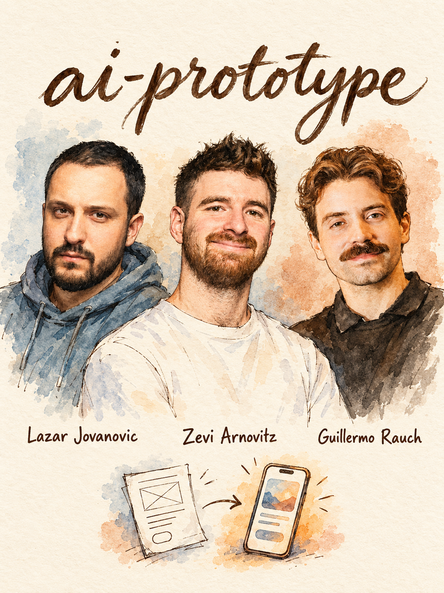
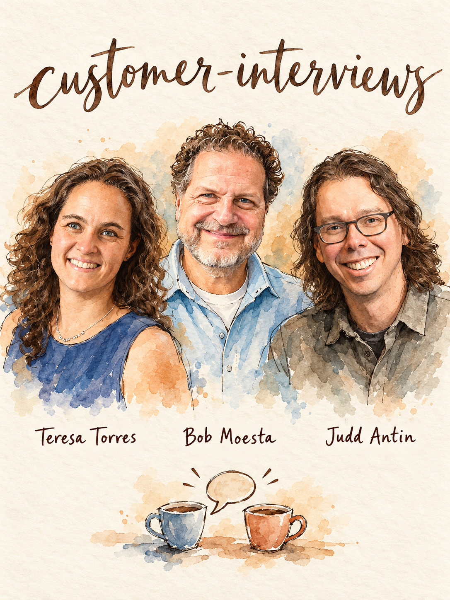
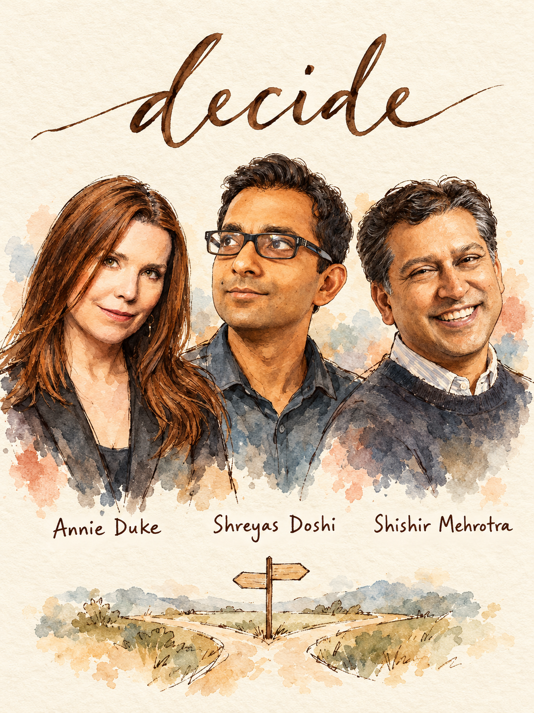
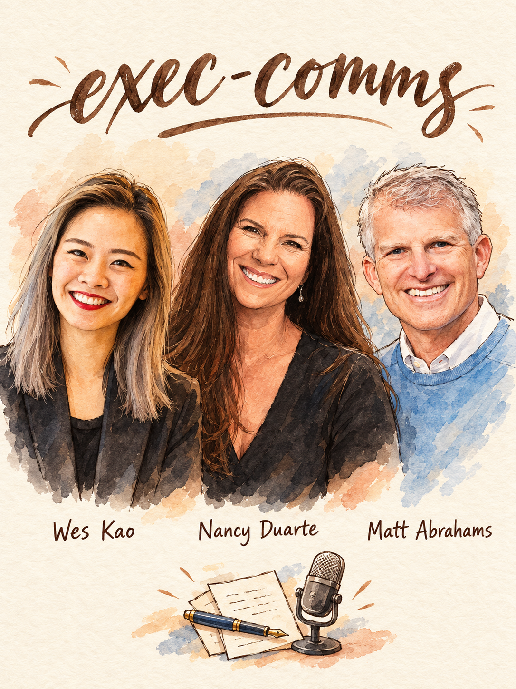
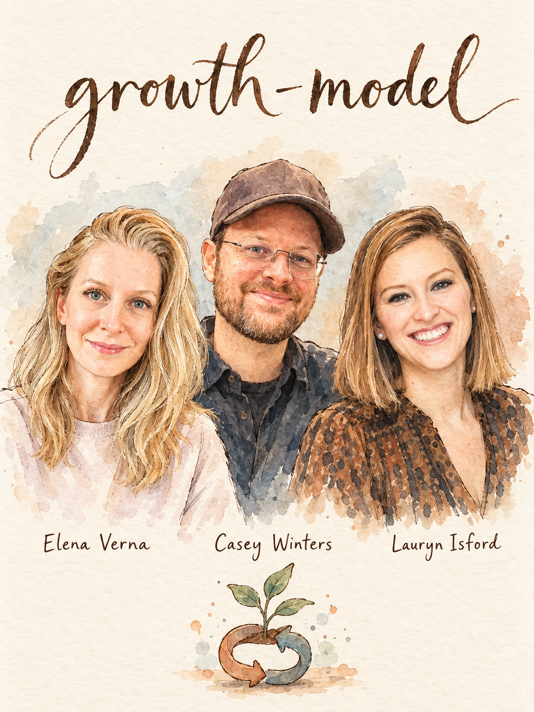
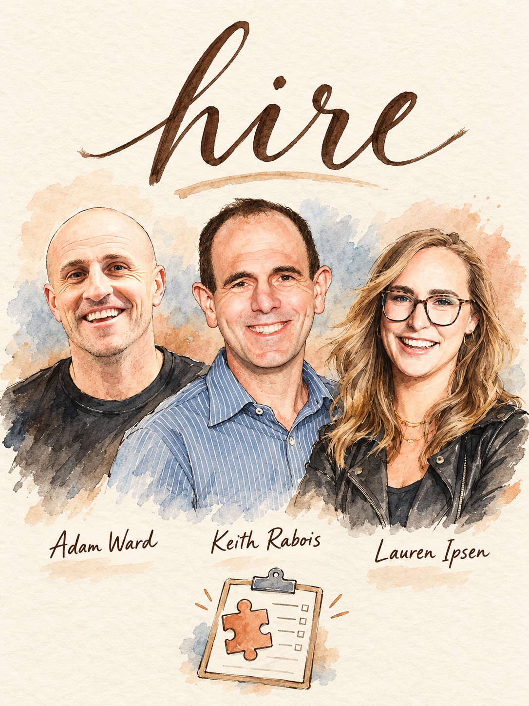
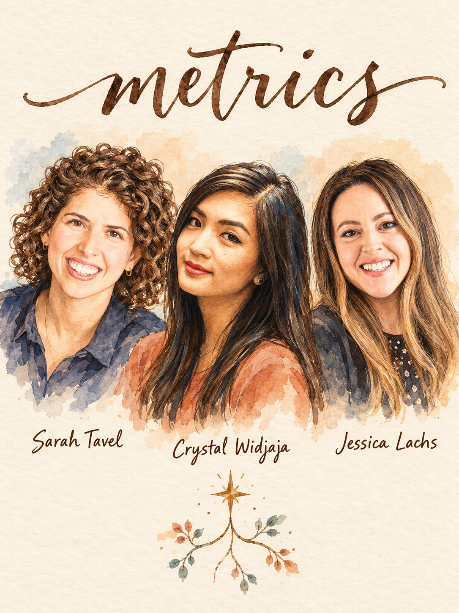
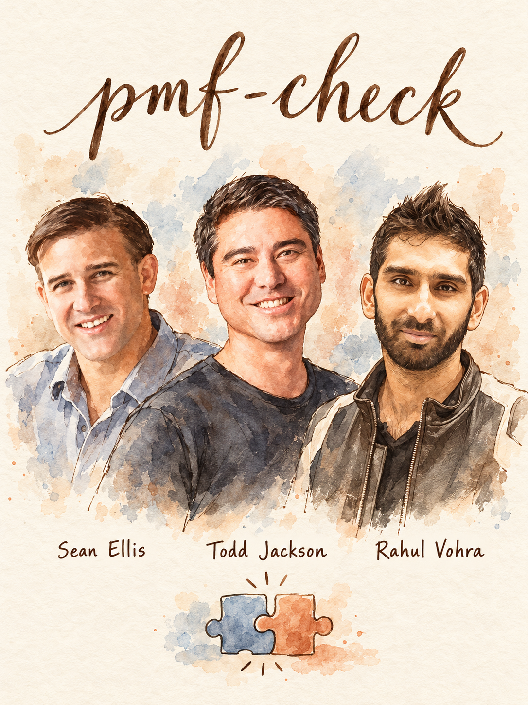
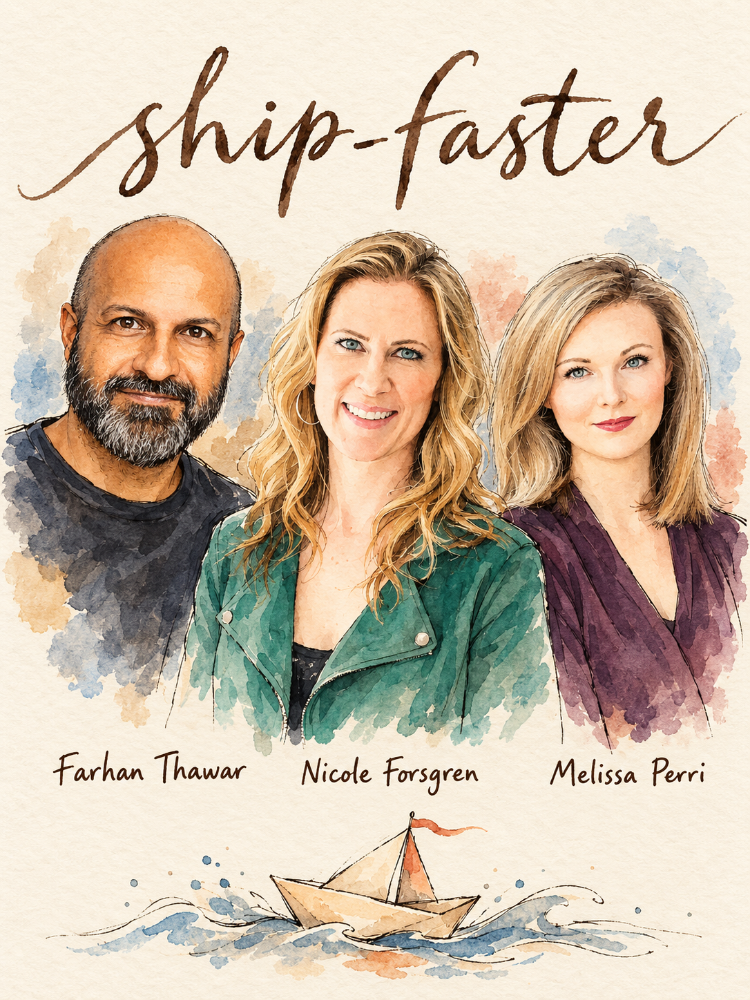
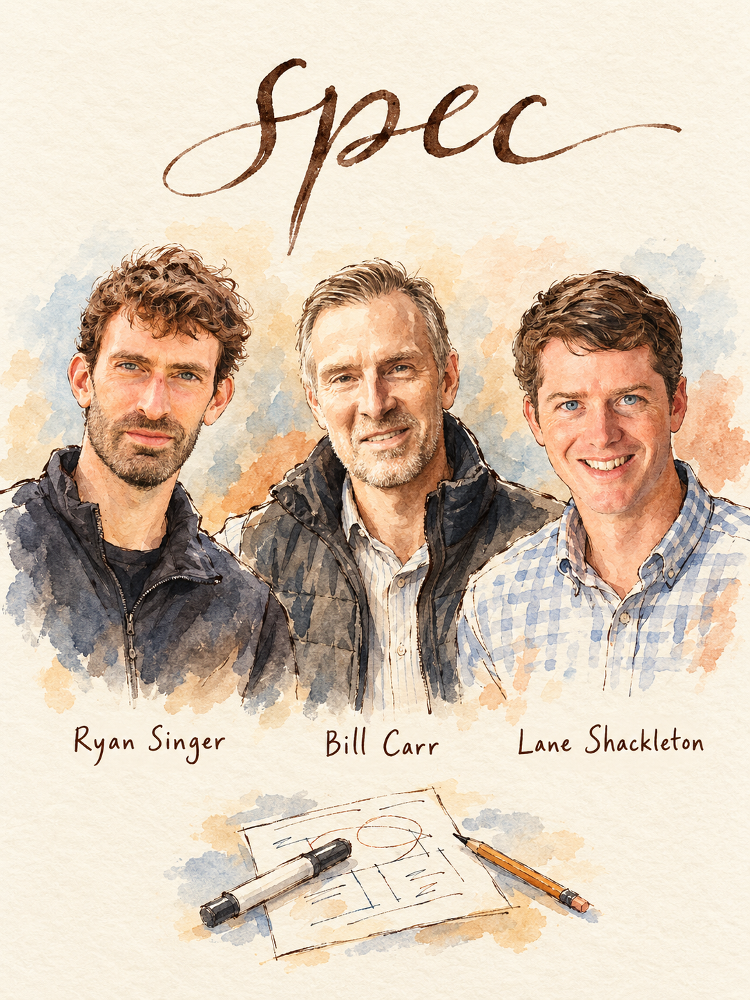

# Illustrated skill cards

25 watercolor and ink team portraits, one for each skill. Click a card to open the full image, or its title to read the skill.

Each skill includes its image at `assets/card.png`, so the illustration travels with the skill when copied. The exact generation prompts and native image dimensions are recorded in [generation-manifest.json](generation-manifest.json).

| | | |
|---|---|---|
| [**agent-workflow**](../skills/agent-workflow/SKILL.md)  | [**ai-product-bets**](../skills/ai-product-bets/SKILL.md)  | [**ai-prototype**](../skills/ai-prototype/SKILL.md)  |
| [**b2b-sales**](../skills/b2b-sales/SKILL.md)  | [**career**](../skills/career/SKILL.md)  | [**craft-review**](../skills/craft-review/SKILL.md)  |
| [**customer-interviews**](../skills/customer-interviews/SKILL.md)  | [**decide**](../skills/decide/SKILL.md)  | [**eval-plan**](../skills/eval-plan/SKILL.md)  |
| [**exec-comms**](../skills/exec-comms/SKILL.md)  | [**experiment**](../skills/experiment/SKILL.md)  | [**growth-model**](../skills/growth-model/SKILL.md)  |
| [**hard-conversations**](../skills/hard-conversations/SKILL.md)  | [**hire**](../skills/hire/SKILL.md)  | [**influence**](../skills/influence/SKILL.md)  |
| [**launch**](../skills/launch/SKILL.md)  | [**metrics**](../skills/metrics/SKILL.md)  | [**pmf-check**](../skills/pmf-check/SKILL.md)  |
| [**position**](../skills/position/SKILL.md)  | [**price**](../skills/price/SKILL.md)  | [**prioritize**](../skills/prioritize/SKILL.md)  |
| [**ship-faster**](../skills/ship-faster/SKILL.md)  | [**spec**](../skills/spec/SKILL.md)  | [**strategy**](../skills/strategy/SKILL.md)  |
| [**validate-idea**](../skills/validate-idea/SKILL.md)  |  |  |

## Private references

`refs/` is reserved for local, private likeness reference photos and source notes; it is not included in a clone. It is excluded from Git by the root `.gitignore`; do not force-add or publish it.
