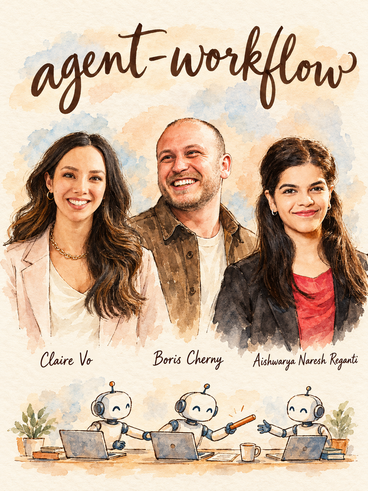

# Agent Workflow



Turn 'we use AI agents' into a written operating system: which agents own which lanes, how much autonomy each has earned, how work gets planned, verified and reviewed, and who is accountable. Built from 447 insights from 110 Lenny's Podcast guests. **Lead team:** Claire Vo, Boris Cherny, Aishwarya Naresh Reganti.

## When to use
- You are starting with Claude Code, Codex, Cursor, Devin, OpenClaw or Cowork and want a setup that does not decay in a week.
- Your agent keeps forgetting, looping, claiming it fixed things, or doing the wrong thing confidently.
- You are about to ship a customer-facing agent and need to decide how much autonomy it gets on day one.
- AI is writing the code and review, alignment or merge queues are now the bottleneck.
- You are rolling AI out across a team or company and adoption is stuck at 'a few enthusiasts'.
- A PM wants to build with agents and needs to know what to own, what to hand to engineers, and what to never delegate.
- You want to give an agent access to email, calendar, Slack or code and need a safe permission plan.

## Step 1 - Diagnose (ask before answering)
If the user attached a CLAUDE.md, AGENTS.md, rules file, workflow doc, rollout memo or agent identity file, read it first and skip questions it answers. Otherwise ask at most these four:
1. **Whose work is being agentified?** Your own PM/knowledge work, an engineering team's code, a customer-facing product, or a whole company. *(Routes to personal-lanes play, coding loop, agency ladder, or rollout play.)*
2. **What can the agent touch, and what is the worst thing it could do?** Email, prod code, customer messages, money, private data. *(Sets the starting rung on the autonomy ladder and the security level.)*
3. **What is failing today?** Forgets/loses context, babysitting, bad output, review pile-up, no adoption, runaway cost. *(Routes to context play, plan loop, review policy, rollout, or cost policy.)*
4. **Team size and who owns it?** Solo, 2-10, 10-100, enterprise; is there a named person who cares about the agent working? *(Small teams build; large orgs need a tiger team or head of AI ops.)*

## Step 2 - Pick the play
| If... (situation) | Use | From | Why |
|---|---|---|---|
| One agent is overloaded, forgets, or loses tool access | **One agent per lane** + tools file | Claire Vo; Roman Ugarte | Narrow roles keep context clean; same logic as separate Slack channels |
| Any non-trivial coding task | **Plan mode, then auto-accept** (plan.md with verifiable steps) | Boris Cherny; Alexander Embiricos | Boris starts about 80% of tasks in plan mode; a verifiable plan lets agents run much longer |
| Customer-facing or high-stakes agent | **Agency ladder** V1 route, V2 copilot, V3 resolve | Aishwarya Naresh Reganti, Kiriti Badam | Autonomy is earned; human edits become free error analysis |
| Personal agent with email/calendar/files | **Employee onboarding + progressive trust + single instruction channel** | Claire Vo; Simon Willison; Sander Schulhoff | Prompt injection is unsolved; limit blast radius with structure, not prompts |
| Agent output is wrong or inconsistent | **Context fix + postmortem loop** | Sherwin Wu; Bret Taylor; Zevi Arnovitz | Failures are usually missing context; fix the root so it cannot recur |
| AI code volume outruns review | **AI review on 100% of PRs + human checkpoint/acceptance test** | Boris Cherny; Sherwin Wu; Mike Krieger | Cuts human review from 10-15 min to 2-3 min while keeping a human gate on risk |
| Team adoption is stuck | **Tiger team / head of AI ops + exec dogfooding + role-specific training** | Sherwin Wu; Dan Shipper; Dhanji R. Prasanna | Top-down alone gives negative ROI; bottoms-up alone lacks fuel |
| PM wants to build, or roles are blurring | **Two-week rule + prototype-yes, production-gated** | Amol Avasare; Elizabeth Stone; Max Schoening | Clear ownership and guardrails before everyone ships code |

## Step 3 - Run it

### Play A - Lanes and agent charters (Claire Vo, Roman Ugarte, Tomer Cohen)
1. List your distinct lanes of work (for a PM: planning docs, data questions, inbox/Slack triage, launch tracking, personal ops). If you would not put it in one Slack channel, do not put it in one agent.
2. Give each lane a one-page charter: role, what it owns, what it may never do, tools it may use, escalation rules, one named human owner. Dan Shipper's rule: every agent needs a human who cares about it, or it decays.
3. Keep a `tools.md` that lists each tool and exactly how you want it used. Agents forget what they can do; do not hand-edit the soul/identity file for that (Claire Vo).
4. Onboard by interview, not form: say who the agent is and who you are, let it ask you questions, and let it write its own identity and memory files. Voice-note it (Claire Vo's Yapper API: rambling is the highest-bandwidth input).
5. Build narrow agents first so each can be graded; add an orchestrator only later (Tomer Cohen). For multi-agent systems use a supervisor with subagents, not peer-to-peer gossip (Kiriti Badam).
6. Add proactivity only after trust: a heartbeat check every 30-60 minutes plus scheduled tasks (Claire Vo's soul/heartbeat/schedule/memory).
7. **Done when:** each lane has a charter, an owner and a tools file, and no two agents can both edit the same artifact.

### Play B - Plan-first coding loop (Boris Cherny, Alexander Embiricos, Michael Truell)
1. Start in plan mode: tell the agent not to write code yet. Go back and forth on the plan until it is right, then switch to auto-accept edits (Boris Cherny).
2. Write the plan to `plan.md` with **verifiable steps** (build, run tests, see output). Ask: *why can't you verify your work? Fix it.* Loop until it can (Embiricos).
3. Chunk the work: specify a little, let it build a little, review, repeat. One giant spec is a recipe for disaster today (Michael Truell). Hand over tasks, not problems (Scott Wu).
4. Ask for the ambitious change; if it fails, restart from scratch and tell it what failed instead of patching the same dead attempt (Benjamin Mann).
5. Run independent tasks in parallel (Boris: multi-Claude-ing; Scott Wu: five tasks, five agents; Sherwin Wu: 10-20 threads). Do not parallelize tasks that depend on each other.
6. Use the strongest model first; compare tokens-to-finish, not price per token (Boris Cherny). Split by strength only when you have the habit (Zevi Arnovitz: fast model for simple execution, Codex for the worst bugs).
7. Do not box the model in with rigid orchestration: give tools plus a goal (Boris Cherny). Counterweight: keep humans on architecture and concurrency (Dhanji R. Prasanna).
8. **Done when:** a task goes plan, approve, execute, verify with no manual edits. Max Schoening's test: every human intervention should feel like a bug in your verification loop.

### Play C - Autonomy ladder (Aishwarya Naresh Reganti, Kiriti Badam, Claire Vo)
| Rung | Agent may | Human role | Promote when (default thresholds, tune them) |
|---|---|---|---|
| 0 Observe | Read only (calendar, tickets, repo) | Reads output | Summaries are right on 2 consecutive weeks |
| 1 Suggest | Draft, classify, route; every action undoable | Decides and logs edits | Drafts used mostly as-is for ~4 weeks (Aishwarya's V2 to V3 signal) |
| 2 Act with a risk gate | Auto-handle low-risk cases; escalate high-risk or high-value | Handles carve-outs | Escalation rules stable; no surprise incidents (Anish Acharya's risk gate; Claire Vo's carve-outs) |
| 3 Act and report | Execute, then report what it did and how to test it; confidence stated up front (Scott Wu) | Reviews after the fact | Failure modes known and logged |
| 4 End to end | Resolve fully; humans sample-QA | One reviewer for many (Vercel: 10 SDRs became 1 reviewer once conversion held flat) | Only with a metric that matches human baseline |
Steps: (1) classify each lane's actions by risk, (2) set the starting rung so a mistake is cheap, (3) log every human edit as free error analysis, (4) review traces together as PM + engineer + data, (5) promote one rung at a time with a written criterion, (6) when a new data distribution appears, drop a rung. Do not default to an agent: map the workflow and use ML, deterministic code and LLMs each where they fit (Aishwarya).

### Play D - Context fixes and postmortems (Sherwin Wu, Zevi Arnovitz, Bret Taylor, Lazar Jovanovic)
1. When the agent fails, first ask: did it have the information? Inspect its files (Claire Vo).
2. Write tribal knowledge into the repo: markdown docs, comments, structure, skills. Audit weird undocumented enterprise rules and dead taxonomies (Aishwarya).
3. Run a postmortem on every miss: ask the agent what in its prompt or tooling caused it, then patch the rules file, command or doc (Zevi Arnovitz).
4. After a fix, ask how you should have prompted it to do this in one go, and write the answer into the rules file (Lazar Jovanovic).
5. Keep the rules file short. Prefer a thin starter template with one trivial test so the agent copies existing patterns (Simon Willison) over paragraphs of preferences.
6. After a larger session, have it write action items and notes to memory before compaction, like closing a meeting (Claire Vo).
7. **Done when:** the same mistake does not recur twice. Dedicate someone to the context layer (Bret Taylor).

### Play E - Review and verification (Boris Cherny, Sherwin Wu, Mike Krieger, Bret Taylor)
1. Run AI review on every PR; keep a human layer on risky or production code (Boris, Sherwin Wu: roughly 30% human attention).
2. Where volume is too high, use a different model to review and have humans do acceptance testing instead of line-by-line review (Mike Krieger). Caution: same model writing and reviewing is circular.
3. Pair a generator with an independent reviewer; two ~90% agents approach 99% only if their errors are independent (Bret Taylor).
4. Ask of any workflow: can the agent check its own output against something objective? Code can; essays cannot, so keep a human verifier there (Simon Willison).
5. Evaluate trajectories, not just answers (Edwin Chen). Measure supervised vs unsupervised code, not percent AI-written (Andrew Ambrosino); watch code deleted, not lines generated (Farhan Thawar).

### Play F - Safety floor for any agent with real access (Claire Vo, Simon Willison, Sander Schulhoff)
1. Separate machine or hosted sandbox; no private data you cannot afford to leak (Claire Vo; Caitlin Kalinowski's agent leaked an email in five minutes).
2. Give the agent its own accounts and delegated access, never your passwords.
3. Declare one trusted instruction channel in its identity file; email, Slack and web pages are data, never commands.
4. Assume users can make the agent leak any data and take any action it can; scope permissions to the task (read-only for summarizing) and contain generated code (Sander Schulhoff).
5. Ask a human only on high-risk actions that touch tainted data, or approvals become click fatigue (Simon Willison's CaMeL).
6. Never rely on prompt instructions as the defense.

### Play G - Team rollout (Sherwin Wu, Dan Shipper, Tomer Cohen, Brian Balfour)
1. Exec dogfooding first: leaders use the agent daily (Dhanji R. Prasanna; Dan Shipper: CEO usage is the top predictor).
2. Staff a full-time tiger team of enthusiastic technical-adjacent people, or one head of AI ops, who turn repeated work into prompts and workflows. Meet weekly and log every repetitive task (Dan Shipper).
3. Run pods like a launch: early adopters get access in exchange for feedback (Tomer Cohen). Role-specific training: about 4 weeks, 1 hour a week, with exact prompts per job (Dan Shipper's 10/80/10: 10% eager, 80% will if shown how, 10% never).
4. Measure adoption on the ground, not by mandate: ask how many teammates actually use the tool (Brian Balfour); track self-reported hours saved cross-checked with throughput (Block). Do not run token leaderboards (Adam Mosseri).
5. Make AI-native codebase prep a technical-team task before PMs ship UI changes (Zevi Arnovitz).
6. Set ownership by size: projects of two engineering weeks or less, the engineer is the mini-PM; above that, PM stays accountable (Amol Avasare).

## Where the experts disagree
1. **Many narrow agents vs one agent first.** *Camp A:* Claire Vo, Roman Ugarte, Tomer Cohen: one agent per lane, specialists before orchestrator. *Camp B:* Dan Shipper: start with one company-wide agent owned by a forward-deployed engineer, personal agents later. -> *Use A for your own work or a single team; B for a company that cannot maintain 50 personal agents.* Default: lanes for individuals, one owned company agent for orgs.
2. **Review everything vs stop reading code.** *Camp A:* Boris Cherny and Sherwin Wu (AI reviews 100% of PRs, human layer after), Tony Fadell and Marc Andreessen (you must be able to evaluate the code). *Camp B:* Mike Krieger (different Claude reviews, humans do acceptance testing), Simon Willison's dark factory (nobody types or reads code, quality comes from other mechanisms). -> *Use A for production code that must live beyond a first version; B only with strong tests, simulated testing and mature teams.* Default: AI review plus a human gate on risk.
3. **Unlimited tokens vs ROI discipline.** *Camp A:* Boris Cherny and Max Schoening: do not optimize early; exploration is what to optimize. *Camp B:* Adam Mosseri, Dianne Penn: no leaderboards, goals are discovery not tokens burned; caps tied to ROI. -> *A while ideas are being found, B once spend is material (Max Schoening expects ROI questions in 6-12 months).* Default: uncapped pilots with a review date.
4. **Should PMs ship code?** *Camp A:* Lazar Jovanovic (demo, don't memo), Guillermo Rauch (everybody ships), Max Schoening (code to master the material). *Camp B:* Amol Avasare and Nikhyl Singhal (leverage is the why and what, or tooling that keeps you on top of engineers), Elizabeth Stone (prototype yes, ship to production no). -> *A in small companies and for prototypes; B at scale.* Default: PMs prototype and build internal tooling; production PRs go through an engineer.
5. **Hard constraints vs bottoms-up.** *Camp A:* Brian Balfour: hard constraints (headcount caps, no new hires until AI proven insufficient). *Camp B:* Sherwin Wu, Tomer Cohen: exec support plus bottoms-up pods; top-down-only mandates fail. -> Default: constraint on the question asked, tiger team on the answer.

## Deliverable
Produce this charter, filled with the user's context, ready to paste into a doc or rules file.

```markdown
# Agent Workflow Charter - <team / person>, <date>

## 1. Context
Who/what is agentified: ...  | Worst-case action: ...  | Biggest current failure: ...

## 2. Lanes
| Lane | Agent / tool | Owner (human) | Owns | Never does | Tools file |
|---|---|---|---|---|---|

## 3. Autonomy ladder (per lane)
| Lane | Current rung | Next rung | Promotion criterion | Metric + threshold | Review date |
|---|---|---|---|---|---|

## 4. Work loop
Plan (plan.md with verifiable steps) -> approve -> execute -> verify -> review.
Parallel work allowed for: ...  | Always sequential: ...  | Model policy: ...

## 5. Rules file (top 10 lines)
1.  ... (context, conventions, how to report what was done and how to test it)

## 6. Review policy
AI reviewer on: ...  | Human gate on: ...  | Acceptance tests: ...  | Intervention-rate target: ...

## 7. Security floor
Machine/sandbox: ...  | Accounts/permissions: ...  | Trusted instruction channel: ...  | Data that must never reach the agent: ...

## 8. Rollout and ownership
Tiger team / AI ops owner: ...  | Pilot pods: ...  | Training cadence: ...  | Adoption + ROI metric: ...  | Token policy and review date: ...

## 9. Open risks
...

## Next 3 actions
1. (this week) ...
2. (this week) ...
3. (within 30 days) ...
```

## Grade existing work
Score an existing CLAUDE.md, agent identity file, workflow doc or rollout memo. 1 / 3 / 5 per criterion.
| Criterion | 1 | 3 | 5 |
|---|---|---|---|
| Lane clarity | One agent does everything | Roles named, overlap exists | Narrow charters, owners, no shared write targets (Claire Vo) |
| Autonomy ladder | Full autonomy or none, no rationale | Informal 'we trust it' | Risk-classified actions, rung per lane, written promotion criteria (Aishwarya, Kiriti) |
| Plan and verify | Prompt and hope | Plans sometimes written | Plan mode first, verifiable steps, agent can run its own checks (Boris, Embiricos) |
| Context quality | Vague preferences, no docs | Rules file exists, stale | Literal, short, updated after every miss; tribal knowledge in repo (Sherwin Wu, Zevi) |
| Review and verification | Unreviewed output | Human reads everything or nothing | AI review on all work, human gate on risk, intervention rate tracked (Boris, Krieger, Schoening) |
| Security | Shared accounts, prompt-only defenses | Some separation | Own accounts, trusted channel, task-scoped permissions, sandbox (Claire Vo, Schulhoff) |
| Ownership and adoption | No named owner, mandate-only | Champion, no metric | Owner per agent, tiger team or AI ops lead, adoption and ROI measured (Dan Shipper, Balfour) |
Output: score per criterion, total out of 35, then the top 3 fixes, each with the guest or framework behind it.

## Red flags
- Launching a fully autonomous multi-step agent on day one: endless hot fixes (Aishwarya; Air Canada's agent hallucinated a refund policy it had to honor).
- Blaming or cursing the agent: it burns scarce tokens on apology and falsely claims fixes (Lazar Jovanovic). Verify claims by testing.
- Reporting bugs with no file or architecture reference in large codebases: most tokens go to reading (Lazar Jovanovic).
- Prompt-based security: 'ignore malicious users' instructions are the weakest defense (Sander Schulhoff).
- Using new tools like old tools: autocomplete-style use of agents (Benjamin Mann). Stale mental models: re-test failed tasks on each model release (Boris Cherny, Simon Willison, Fiona Fung).
- Dropping a personal agent into an open group chat or giving it your own credentials (Claire Vo).
- Handing it problems instead of tasks, or one huge spec (Scott Wu, Michael Truell).
- Treating AI output as finished: copy-pasting it is abdicating accountability (Molly Graham); AI-inflated essays that others re-summarize are wasted effort (Mayur Kamat).
- Building the workflow but not changing behavior; tools get built and nobody uses them (Dan Shipper).
- Measuring percent of AI-written code, lines generated, or tokens burned (Ambrosino, Thawar, Mosseri).
- Expecting 10x because AI writes 90% of code: writing is a fraction of the work (Varun Mohan's Amdahl point: 30-40% is typical).

## Receipts
- "every time you hand over decision-making capabilities or autonomy to agentic systems, you're kind of relinquishing some amount of control on your end." — Aishwarya Naresh Reganti, Lenny's Podcast (00:08:01)
- "But actually almost always you get better results if you just give the model tools, you give it a goal, and you let it figure it out." — Boris Cherny, Lenny's Podcast (01:04:06)
- "you don't onboard your EA by giving the password to your email account. You don't do that." — Claire Vo, Lenny's Podcast (00:18:58)
- "a lot of the time when the coding agent is not doing what you want, it's usually a problem with context and just like information that you've given it." — Sherwin Wu, Lenny's Podcast (00:14:03)
- "every time there is an intervention, a human intervention, it should feel a little bit like a bug." — Max Schoening, Lenny's Podcast (00:38:23)
- "in order for an AI agent to be useful right now, it really needs a human who cares about it." — Dan Shipper, Lenny's Podcast (00:14:38)

## Go deeper
- `references/frameworks.md` - every framework in this skill, how to run it
- `references/quotes.md` - verified quotes with timestamps
- Related skills: `eval-plan` (hand off when you need error analysis, criteria and judges for the agent's output); `ai-prototype` (hand off to turn an idea into a working prototype with AI builders); `ship-faster` (hand off when the real problem is delivery speed beyond agents, e.g. review and alignment bottlenecks); `ai-product-bets` (hand off when deciding which agent features to build at all).
