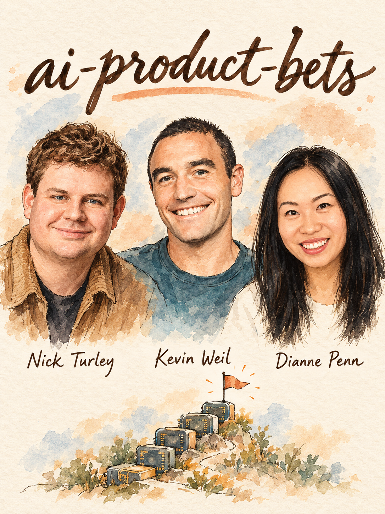

# AI Product Bets



Decide which AI features to ship now, build for the next model, shelve with a retest trigger, or kill, and prove each one gets better as models improve. Built from 405 insights from 118 Lenny's Podcast guests. **Lead team:** Nick Turley (ChatGPT), Kevin Weil (OpenAI), Dianne Penn (Anthropic).

## When to use
- You have a list of AI feature ideas (or a roadmap/PRD) and need to cut it to the few that matter
- A new model just shipped and you need to know what it unlocks, obsoletes or makes cheaper
- Someone says 'we need an AI strategy' and the board or CEO wants a point of view this quarter
- A feature underperformed or 'didn't work yet' and you must decide to kill or shelve it
- You are choosing agent vs assistant vs chat, or frontier vs cheaper vs custom model
- You fear a lab (OpenAI, Anthropic, Google) will ship your product as a feature
- You are an incumbent deciding between bolting AI on and rebuilding around it
- You are an enterprise buyer or builder planning to automate a critical process

## Step 1 — Diagnose (ask before answering)
If the user attached a roadmap, PRD, deck or repo, read it first, extract the feature list, and only ask what is still missing. Max 4 questions:
1. **Where do you sit?** Model builder / app on someone else's model / incumbent adding AI / enterprise automating a process. *Routes to: embed-with-research vs scaffolding ledger vs rebuild-or-bolt-on vs process-automation play.*
2. **What does a wrong answer cost, and what is the hit rate today?** (Rough % on real tasks.) *Routes to: model maximalism vs scaffold-what-you-cannot-tolerate; UI sizing.*
3. **Can you survive 3-6 months of weak traction waiting for a model?** *Routes to: edge-of-capability bet vs ship-what-works-now.*
4. **What proprietary data, distribution or workflow do you own, and which candidate features already failed?** *Routes to: moat test and the retest shelf.*

## Step 2 — Pick the play
| If... (situation) | Use | From | Why |
|---|---|---|---|
| Long list of AI ideas, need a cut | Bet triage: problem-first gate, then the 2X test and Claude 8 test | Nick Turley, Dianne Penn, Inbal Shani | Kills features that do not compound with model quality |
| App on a foundation-model API, model improves every 3-4 months | Scaffolding ledger + model-release ritual | Cat Wu, Boris Cherny, Sherwin Wu | Gains from workarounds (often 10-20%) get wiped by the next model |
| Feature almost works / failed last quarter | Retest shelf (build what does not work yet) | Andrew Ambrosino, Cat Wu, Eric Simons | Same product shape can fail in November and win in February |
| Automating an important enterprise process | Baseline-accuracy check + nines budget | Jason Droege, Aishwarya Naresh Reganti, Asha Sharma | POC at 60-70% hides 6-12 months of work |
| Incumbent unsure bolt-on vs rebuild | Feature-or-category test, then diverge-converge | Marc Andreessen, Paul Adams, Tomer Cohen | Decides retrofit vs rebuild before spending roadmap |
| Platform risk: will a lab build this? | Where-labs-will-go test + shovels/mine/middle | Logan Kilpatrick, Matt MacInnis, Bret Taylor | Generic assistants get crowded out; vertical + owned data survives |
| Building an agent or autonomous flow | Autonomy ladder + control checkpoints + lethal trifecta check | Alexander Embiricos, Nick Turley, Simon Willison | Trust and security, not capability, gate adoption |
| Choosing models / build vs adapt vs partner | Pareto-vs-frontier routing, custom-model spots | Anish Acharya, Michael Truell, Cameron Adams | Spend frontier money only where upside is unbounded |

## Step 3 — Run it

### Play A — Bet triage (always run first)
1. List every candidate feature (cap at 15). Write the user job in one line each. Start from what the product does and why people use it (Paul Adams), not from the technology.
2. **Problem-first gate.** Delete any feature without a named user, pain and baseline. Ask: is this problem real without the word AI in it? (Inbal Shani, Marily Nika, Melanie Perkins.) Chatbot bolted on to an existing product = automatic fail (Cameron Adams, Paul Adams).
3. **Baseline accuracy check** (Jason Droege). Human process 10-20% accurate or liked: AI wins big, route the remainder to humans. Human process already ~98%: do not expect AI to deliver the last 2%.
4. **2X test** (Nick Turley). *If the model were twice as smart tomorrow, would this feature be twice as good?* Tag each feature:
   - **Rides** the curve: invest.
   - **Crutch**: patches a model weakness (Cat Wu's to-do list). Time-box it and write the deletion trigger.
   - **Orthogonal**: SOC 2, permissions, compliance. Required, but do not count it as an AI bet.
   - **Not yet**: works under ~50% of the time. Goes to Play B.
5. **Claude 8 test** (Dianne Penn). Write 3 sentences: what do users do differently when a much stronger model arrives, and does today's UX survive it? Features that disappear in that world are crutches.
6. **Feature or category?** (Marc Andreessen.) Is AI an added ingredient (AI editing in Photoshop) or does it make the workflow unnecessary (generate instead of edit)? Category answer = rebuild, not retrofit. Also ask the hard-generative test (Gustav Soderstrom): could this product exist without generative AI? Most things you list will be iterative improvements; budget them as such.
7. Verdict per feature: **Ship now / Build for next model / Shelve + retest / Kill**. Done when every feature has one verdict and one owner.

### Play B — Retest shelf (build what does not work yet)
1. For each Not-yet feature, prototype for one week against the current frontier model (Andrew Ambrosino: prototype all of them, ship what is ready, let the rest bake).
2. Write a **capability-gap statement**: the specific failure (*misses 1 of 20 call sites*, *invents policy*) not 'quality is low' (Cat Wu: know what is missing for it to work).
3. Keep the prototype and failing cases as fixtures. Failure in market no longer proves the shape is wrong; Operator, Atlas agent and Codex are one idea re-released as intelligence improved (Ambrosino).
4. Set the retest trigger: every new model release (roughly every 3-4 months, Kevin Weil). Run the fixtures first, the same week the model lands (Eric Simons shipped Bolt after a model crossed the threshold; Dharmesh Shah revived a failed bot six years later).
5. **Match form factor to today's ability.** Original Codex web delegated whole tasks and was too early; local, ask-questions Claude Code fit what models could do then (Ambrosino). Ship the shape that works at today's hit rate; plan the next generation (Scott Wu: expect many generations of agent product).
6. Check product overhang: what today's model already does that users do not know (Dianne Penn). Surface it before building more.

### Play C — Scaffolding ledger + model-release ritual
1. Keep a table: scaffold | weakness it patches | measured gain | cost to keep | delete trigger.
2. **Build rule.** Expected gain 10-20% and a model release is likely within 6 months: do not build, wait (Boris Cherny). Keep scaffolding only for errors you can never tolerate (Kevin Weil).
3. **Every model launch:** read the entire system prompt and ask per section whether the model still needs the reminder; remove it if not (Cat Wu). De-emphasize crutch features in the UI.
4. **Pull forward, then delete** (Roman Ugarte): predict what the next model makes baseline, build it now with engineering, delete the scaffold when it lands, move to the next impossible thing.
5. **Model sommelier habit** (Anish Acharya): ship something small with every new model; log its shape (creative, precise, long-horizon, vision). Models are not fungible.
6. Update priors (Aparna Chennapragada): re-run anything that failed a few months ago before you say 'AI cannot do that'.

### Play D — Reliability bar and fault-tolerant design
1. Measure the hit rate on 50-100 real tasks (see `eval-plan`). Without it, every other decision is a guess.
2. **Size the UI to the hit rate** (Gustav Soderstrom): near-zero error needed for one big button; at 1-in-5 hit rate show about five candidates plus an easy 'no, wrong' escape hatch. Midjourney's four-image grid is the canonical case.
3. A 30% acceptance rate is not annoying if users learn which suggestions to ignore and mistakes are cheap to dismiss (Varun Mohan, Alexander Embiricos). It is fatal when a wrong output hurts the user (Alex Komoroske: design so failure is not catastrophic).
4. **Budget the nines.** POCs hit 60-70% fast; each extra nine of reliability costs about an order of magnitude more (Droege). Plan 6-12 months for a robust important enterprise process, 4-6 months to real ROI on a critical workflow (Aishwarya Naresh Reganti). One-click agents are marketing.
5. Make the UI promise match data quality; show sources and uncertainty (Noah Weiss). Ask the jagged-frontier questions for non-experts (Benedict Evans): can the user tell where it will work, tell after it worked, and decide what to do with it?
6. For algorithmic products, assign each decision to the algorithm or to a person and give operators controls (Adriel Frederick). ML optimizes inside constraints humans set.

### Play E — Moat and platform-risk test
1. **Layer.** Frontier models need $2B+ raisable without product progress (Ben Horowitz, Bret Taylor): not a startup play. Tooling is viable if you can answer why customers will not take the infra provider's version. Applied agents for one deeply understood business problem is the open lane.
2. **Shovels, mine or middle** (Matt MacInnis): sell the model, own proprietary data, or you are in the middle renting both and need a durable insight.
3. **Lab test** (Logan Kilpatrick): general assistants and agents will be built by labs; verticalized products (sales agent, legal) will not. Ask: would a lab ship this inside its general product within 12 months?
4. **Seven powers lens** (Hamilton Helmer): AI adds no eighth power. Ask whether fixed model costs spread across users (scale), whether one user's usage improves another's (network), whether the model learns a user in a way that raises switching costs.
5. **Differentiator must improve as LLMs improve** (Tamar Yehoshua). If your edge is compensating for model weakness it expires. Context and memory is the platform moat (Brian Balfour); data freshness and structure is about 90% of the effort (Shaun Clowes).
6. **Build / partner / adapt** (Cameron Adams, Michael Truell, Asha Sharma): partner for commodity capability, build where you have a data advantage, adapt an existing model with your data rather than training from scratch. Custom models only where cost or speed forces it (autocomplete under 300 ms) or foundation models are weak.
7. **Economics.** Capability cost falls about 10x a year (Kevin Weil), but inference is a real cost today: capture value from day one (Madhavan Ramanujam) and re-run unit economics at each release.

### Play F — Agent autonomy and safety gate
1. **Ladder** (Alexander Embiricos): pair interactively, capture permissions and context as a byproduct, delegate longer tasks, then proactive work. Unattended runs went from 15-30 seconds to 10-30 minutes in a year (Boris Cherny); design for multi-hour runs.
2. **Control** (Nick Turley): live view of what the agent does and confirmation on consequential steps. Friction buys trust. Offer both agent and assistant modes (Amjad Masad).
3. **Lethal trifecta** (Simon Willison): private data + untrusted instructions + a way to send data out. If all three are present, cut one, usually exfiltration.
4. **Three tiers** (Sander Schulhoff): chatbot touching only the user's own data needs no AI-specific defenses; verify it really is only a chatbot; agents on untrusted data need architectural limits or should not ship. Do not buy guardrails for a false sense of safety.
5. Run toward high-stakes use cases rather than blocking them: work with experts, state limits, route struggling users to resources (Nick Turley).

### Play G — Run the portfolio
1. Weeks 1-3 diverge: let teams prototype, accept duplicate effort. Then converge on the 4-5 biggest bets and review them weekly (Tomer Cohen). Fall-2022 move: drop roadmaps, return to objectives, ask how the new tech achieves them better.
2. Small prototyping team outside normal process, then hand the hypothesis to the team owning the customer problem (Paige Costello, Noah Weiss). Do not bolt AI onto one team (Paul Adams).
3. If you have model access, embed PMs with research and post-training (Mike Krieger, Peter Deng, Tara Seshan: tie bets to the research roadmap).
4. The product leader owns the objective function, data collection and fine-tuning budget (Tomer Cohen).

## Where the experts disagree
**1. How far ahead to build.** *Camp A:* build for the model 6 months out and accept weak early PMF (Boris Cherny, Amjad Masad, Benjamin Mann, Jeetu Patel); sit right at the edge of capability (Kevin Weil). *Camp B:* 2-3 months out only, a year out is equally wrong (Tara Seshan); elicit maximum capability from today's model on a golden path (Cat Wu); too early failed Codex web (Andrew Ambrosino). -> *Use A when you have runway and a prototype that clicks the day the model lands; B when you need revenue within two quarters.* **Default:** ship the shape that works today, keep a 6-month prototype on the shelf.

**2. Scaffolding, fine-tuning and custom models.** *Camp A:* bet on the general model, avoid fine-tuning, treat workflow as temporary (Boris Cherny, Sherwin Wu, Tamar Yehoshua). *Camp B:* pick spots for custom models (Michael Truell: every Cursor magic moment uses one), adapt models with your data (Asha Sharma), hybrid niche models for safety-critical domains (Inbal Shani); base intelligence is already enough and the work is workflow idiosyncrasies (Scott Wu). -> *Use A by default; B when latency, cost, privacy or a domain weakness forces it.*

**3. Chat as the interface.** *Camp A:* chat is amazing because it is universal (Kevin Weil); right when you do not know what to use AI for (Alexander Embiricos). *Camp B:* yes to natural language, no to turn-by-turn chat (Nick Turley); beyond-chat is the edge (Logan Kilpatrick); chat lacks precision (Michael Truell); consumer wants something between chat and TikTok (Anish Acharya). -> *Chat as entry point and long-tail catch-all; prescribed or generated UI for high-volume known tasks and experts.*

**4. Are wrappers viable?** *Camp A:* thin-wrapper critique is wrong, app-layer fit-for-purpose work is durable (Ben Horowitz, Marc Andreessen, Varun Mohan). *Camp B:* middle layer gets crushed (Matt MacInnis); AI adds no new power (Hamilton Helmer); being an AI company is not a business (Sam Lessin). -> *Viable only with owned data, workflow depth or cross-user learning; otherwise a feature a lab will absorb.*

## Deliverable
```markdown
# AI Bet Memo: <product / team>, <date>
**Position:** <builder | app-layer | incumbent | enterprise>  **Hit rate today:** <% on N tasks>  **Cost of a wrong answer:** <low/med/high>
**Runway for weak traction:** <months>  **Owned data / distribution:** <...>

## 1. Bet table
| Feature | User job + baseline | 2X test (Rides/Crutch/Orthogonal/Not yet) | Claude 8 survives? | Reliability bar | Verdict (Ship / Build-for-next / Shelve+retest / Kill) | Owner |
|---|---|---|---|---|---|---|

## 2. Retest shelf
| Feature | Capability-gap statement | Fixtures location | Retest trigger (model release) | Ship criterion |
|---|---|---|---|---|

## 3. Scaffolding ledger
| Scaffold | Weakness patched | Measured gain | Delete trigger | Owner |
|---|---|---|---|---|

## 4. Moat + platform risk
Layer / shovels-mine-middle / lab-test result / which of scale-network-switching applies / build-partner-adapt choices / model routing

## 5. Safety + autonomy
Tier, trifecta check (legs present, leg cut), autonomy rung today and next, control checkpoints

## 6. Economics
Cost per task now, expected cost in 12 months, pricing implication

## 7. Kill criteria and review cadence
<what evidence ends each bet; weekly bet review; model-release ritual owner>

## Next 3 actions
1. <this week>  2. <before next model release>  3. <within 30 days>
```

## Grade existing work
Score an AI roadmap, strategy doc or PRD. Return the score per criterion, the total out of 40, and the top 3 fixes with the guest behind each.
| Criterion | 1 | 3 | 5 |
|---|---|---|---|
| Problem-first | Starts from 'add AI' | Some features have a named user pain | Every bet has user, pain and human-baseline accuracy (Droege, Inbal Shani) |
| Model-scaling test | No view of model change | Mentions 'as models improve' vaguely | Each feature tagged Rides/Crutch/Orthogonal with the 2X test (Turley, Penn) |
| Time horizon + retest | Static plan | Roadmap reviewed per quarter | Shelf with gap statements and retest on every release (Ambrosino, Cat Wu) |
| Scaffolding discipline | Heavy workarounds, no exit | Some are labeled temporary | Ledger with delete triggers, system prompt reviewed per model (Cat Wu, Cherny) |
| Reliability design | Assumes accuracy | Evals exist, UI ignores hit rate | UI sized to hit rate, escape hatch, nines budgeted (Soderstrom, Droege) |
| Moat + platform risk | 'We use GPT' | Names a moat, no lab test | Layer, shovels/mine/middle and lab test answered (MacInnis, Logan Kilpatrick) |
| Safety + autonomy | Not covered | Guardrails purchased | Trifecta check, tier chosen, control checkpoints (Willison, Schulhoff) |
| Economics + cadence | Ignores inference cost | Pricing set once | Cost curve in plan, value captured from day one, weekly bet review (Weil, Ramanujam, Cohen) |

## Red flags
- Plastering AI on the product because investors like it (Melanie Perkins, Inbal Shani, Marily Nika's shiny-object trap).
- A differentiator that only compensates for LLM weakness (Tamar Yehoshua, Cat Wu, Sherwin Wu).
- Optimizing today's modality, like Replit's self-trained autocomplete, until it is obsolete (Amjad Masad).
- Believing the 60-70% POC means the rest is easy (Jason Droege); selling or buying one-click agents (Aishwarya Naresh Reganti).
- Buying guardrails or detection scores as security; 97% filtering is a failing grade (Simon Willison, Sander Schulhoff).
- Optimizing for engagement or agreement; sycophancy recreates social media's failures (Edwin Chen, Benjamin Mann).
- A playground that people try and leave, not a business (Gaurav Misra); unclear identity so users do not know what to pay for (Tony Fadell).
- Assuming your users are as advanced as Silicon Valley; most use AI in basic ways (Sherwin Wu, Benedict Evans).
- Many parallel AI projects with no blueprint, measurement, observability or evals (Asha Sharma).
- Delegating the objective function, data collection and fine-tuning to engineering (Tomer Cohen).

## Receipts
"let's say Claude 8 comes around. What changes in what users do? And then what does that mean for how you're building today?" — Dianne Penn, Lenny's Podcast (00:34:03)

"Like if we're shipping a feature and it doesn't get 2X better as the model gets 2X smarter, it's probably not a feature we should be shipping." — Nick Turley, Lenny's Podcast (01:04:23)

"The thing I try and remind myself is, the AI models that you're using today is the worst AI model you will ever use for the rest of your life." — Kevin Weil, Lenny's Podcast (01:15:41)

"we actually do this every time we launch a model, we read through the entire system prompt and we reflect on, okay, for each of these sections, does the model really need this reminder anymore, and if not, we'll remove it." — Cat Wu, Lenny's Podcast (01:02:44)

"You fail if you build for where the models are now, you fail if you build for where you think the models will be in a year. Both outcomes are equally wrong." — Tara Seshan, Lenny's Podcast (00:27:27)

"these things take 6 to 12 months to get them truly robust enough where an important process can be automated." — Jason Droege, Lenny's Podcast (00:38:03)

## Go deeper
- `references/frameworks.md` — every framework in this skill, how to run it
- `references/quotes.md` — verified quotes with timestamps
- Related skills:
  - `eval-plan` — hand off once you need the hit-rate measurement and judges behind Play D
  - `strategy` — hand off when the question is company-level moat and where to play beyond AI
  - `agent-workflow` — hand off for how your own team builds with agents
  - `price` — hand off when inference cost and value capture become the open question
