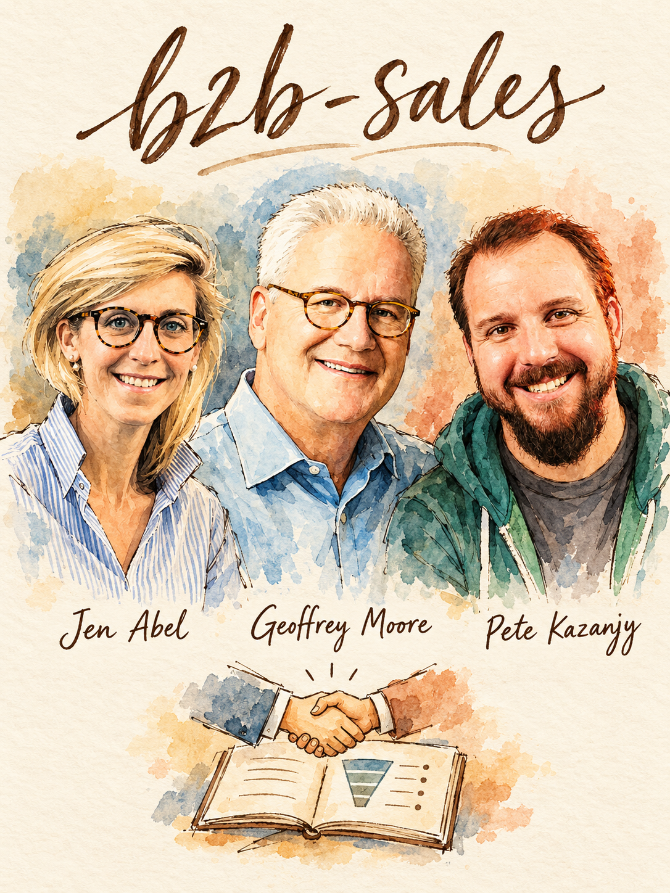

# B2B Sales (Founder-Led Motion)



Turns 'we need to start selling' into a written motion: who to sell to, what to say, how to run each call, and when to hand it off. Built from 237 insights from 49 Lenny's Podcast guests. **Lead team:** Jen Abel, Geoffrey Moore, Pete Kazanjy.

## When to use
- You are a founder or PM-turned-seller and have to close your first 10-30 B2B customers
- Outbound gets no replies, or first calls do not turn into second calls
- Deals are fascinated-but-slow, ghosting after demo, or 'lost in procurement'
- You are deciding enterprise vs SMB vs PLG, or how to add sales to a self-serve product
- You are about to hire the first seller (or two) and need to know if the motion is ready to hand off
- You need a pitch, demo or pilot plan for a six-figure account
- You want a pipeline review that tells you which stage is actually broken

## Step 1 - Diagnose (ask before answering)
If the user attached a deck, CRM export, call transcripts, pitch or email sequence, read it first and infer answers. Otherwise ask at most these 4:
1. **How many customers have you closed, and how did the last 5 find you?** (0-10 -> founder-led research mode; 10+ with a repeating pattern -> handoff mode; usage but no buyer -> PLG-to-sales path.)
2. **What is the initial ACV, and is the buyer the same person as the user?** (Abel: about $100K means outbound from day one; about $5K means marketing-led. Different buyer and user means direct or hybrid, per Bret Taylor.)
3. **Does your buyer already know how to buy this category?** (If not: services-first or bowling-alley play. If yes: pitch structure and procurement play.)
4. **Where does the pipeline break: no meetings, no second meeting, no decision, or no signature?** (Routes straight to a play. Abel: it is usually top of funnel, not bottom.)

## Step 2 - Pick the play
| If... (situation) | Use | From | Why |
|---|---|---|---|
| ICP is fuzzy, you say yes to anyone | Favorite-customer ICP + kill criteria + beachhead segment | Jonathan Lowenhar, Pete Kazanjy, Geoffrey Moore | Wrong customer is the most expensive GTM mistake; one segment beats a match under a log |
| ACV about $100K+, exec must sign, no replies | Pincer (exec + N-1) + alpha pitch + manual 30-lead test | Jen Abel | Execs answer one-on-one, not marketing; 3 sentences, counterintuitive |
| Smaller ACV, outbound works somewhat | Cohorts of 10 first meetings + stage-conversion tracking | Pete Kazanjy | You learn per cohort instead of guessing after 100 sends |
| First call with an exec or N-1 | Informal intro call, no slides, ask what needs to change | Jen Abel | They clam up once it feels like a sales process |
| Chasm: early adopters done, pragmatists want references | Problem-first call, shut the laptop, one beachhead segment | Geoffrey Moore | Pragmatists buy what peers bought; lead with their problem |
| 10+ deals closed, you want a repeatable pitch | Setup + follow-through pitch with perfect-world criteria | April Dunford | Frames the decision so the champion can justify picking you |
| Demo is done, group is cold, pilot requested | Pre-demo call, demo the 20%, time-boxed pilot, POC as business case | Jen Abel, Madhavan Ramanujam | Deals are won on 'built for us'; pilots only run when the signing path is mapped |
| Buyer wants to buy but keeps stalling | JOLT: judge, recommend, limit exploration, take risk off | Matt Dixon, April Dunford | 56% of no-decision losses are fear of failure, and urgency makes it worse |
| First rep or SDR hire is on the table | Selling while loop: sell, extract, hire two, scale | Pete Kazanjy, Jason Lemkin | Do not hand off what you cannot yet repeat |
| Self-serve usage but no enterprise deals | PQA/PQL lead paths + admin and terms-page signals + pilot AE | Elena Verna | Usage without a buyer is not a lead |

## Step 3 - Run it

### Play A - Lock the game, ICP and kill criteria
1. **Pick the game.** Enterprise is sales-led and high-value; SMB is marketing-led and high-volume; Abel says the mid-market does not exist (it is upper SMB or lower enterprise) and straddling both makes you lose. Sellers cost money, so check ACV against the motion: Verna puts the traditional sales floor near $15K.
2. **Name your favorite customer.** Which customer would rave about you on the phone? Describe that account and the 2-3 personas (user, technical evaluator, budget owner; Kazanjy). Start with a small white-hot center (Lowenhar).
3. **Write 3 kill criteria** (customers you decline even if they want to sign). Duke's examples for RFP deals: written with a competitor in mind (ask how far along they are), buyer will only discuss price and refuses a demo, no decision maker after a few meetings (offer an executive alignment meeting; kill if refused).
4. **Pick one beachhead segment** with a severe, getting-worse problem and a sponsor whose boss's boss knows their name (Moore's compelling reason to buy). Expand only to adjacent segments: same customer with a new use case, or same use case in a new customer base.
5. **Cap segmentation at three attributes** (Grosser). Done when you can name 30 target accounts and the persona in one sentence.

### Play B - Outbound that earns a first call
1. **Manual 30-lead test (Abel).** Find 30 people you would be excited to learn from. Spend 15-20 minutes per note. Count replies. Zero replies: change the message or the role and try another 30. Only after the parameters are known, enrich and scale with tools (Clay etc.). If you cannot find 30, you have an ICP problem.
2. **Pincer model (ACV $100K+).** Founder writes the executive decision-maker; AE or you write one N-1 (VP/director one step removed). When one replies, pull in the other for role parity. Do not go lower than N-1: it becomes a game of telephone and you learn user value, not executive value.
3. **Write the note: relevant to the role, counterintuitive, about the problem not the solution, 3-4 sentences, readable on a phone without scrolling** (Abel). Run the litmus test for alpha: what would the exec say at the board meeting about this product that shows needle-moving impact to the COO/CEO? Time savings alone sounds like a commodity.
4. **Audio replay test.** Have Gmail read the note aloud and fix anything passive-aggressive.
5. **Warm intros over text, not email**, with the introducer kept on the thread for the first 10-20 messages (Sahil Mansuri).
6. **Hard account that rejects every pitch?** Build a short research report from data only you hold, and send it to the exec with teaching, not a pitch (Mansuri's nine-page report to Facebook).
7. **Lower-ACV motion:** run cohorts of 10 first meetings and update slides and talk track before each next cohort (Kazanjy).
Done when: reply rate is known per segment and you have 10 first meetings booked.

### Play C - Call 1 to signature (enterprise sequence)
1. **Call 1 (30 minutes, informal, no slides, no recorder; Abel).** Open: *I'll keep this informal; I might not need the full 30 minutes.* Swap intros, let them go first. Ask what needs to change going into next year, how they would measure it, why now and why not wait. Spend the last ~10 minutes on what you do, in their words. Chasm-stage variant (Moore): do not demo; say you have seen a serious problem in their industry and ask whether they have it; take handwritten notes.
2. **Name politeness, ask for the no.** *I'm getting the vibe this might not be a good fit or good timing; did I misinterpret?* Never run BANT questions aloud (Abel). About 1 in 4 intro calls should be disqualified for maturity gap and revisited in a year.
3. **Book call 2 on call 1,** with calendars open and who else should join. 'I'll email you' is usually a polite no.
4. **15-minute pre-demo call with the champion:** who should be in the room, what will resonate, what do they want asked. Never demo cold to 4-5 people.
5. **Demo the 20%** of the product that delivers 80% of this buyer's value, restarted in their frame. Ask each new attendee what they want out of it.
6. **Debrief by text within minutes:** *How do you think that went? Can I call in five minutes?* Find who is skeptical and who might kill the deal; offer the skeptic a 15-20 minute session.
7. **Reverse-engineer the deal before any pilot:** when do we sign, who is in procurement, security, legal? If they are a quarter from committing, delay the pilot.
8. **Pilot.** No integration: free, 48-72 hours, 3-4 daily power users plus the champion, 3 specific tasks, success criteria co-authored with the buyer. Integration needed: paid 1-2 month pilot credited against the contract. Frame any POC as co-creating a business case (Ramanujam): get agreement on ROI inputs from day one so nobody attacks the output. Target about 80% pilot success; below that, qualification or product is off.
9. **Paper.** Email what was agreed (pricing contingent on a signing date). Send a Word doc and ask whether to use yours or theirs. Learn who signs (CFO?) and give procurement tight bullets for that person. Do the forms yourself, split technology and service contracts, do not start work until signed, expect procurement to take ~30 days. Stuck in procurement usually means you sold too junior.
10. **Cadence:** every meeting ends with a logged next step (Lemkin). Enterprise is about 15 buyer steps, not 5 CRM stages (Abel). Reply to champions fast, by text.

### Play D - Pitch structure once you have ~10 deals (Dunford)
1. **Setup (a few minutes, a conversation not a monologue):** your insight into the market, honest pluses and minuses of each alternative (including competitors), then the perfect world: *can we agree a good solution needs A, B and C?* If they disagree, jointly conclude you are not the fit.
2. **Follow-through (more than half the call):** introduce yourself and category, demo organized around A, B and C, show proof (before-and-after case or third-party data), pre-empt silent objections (IT, security, cost, adoption), end with the specific next step.
3. **Arm the champion** with compliance info, training plan, ROI calculator and how procurement typically works. Opening with an industry trend is weak because competitors can claim it too.
4. **Roll out** by training your best rep first, testing on qualified prospects (not existing customers), and having that rep sell it to the team.

### Play E - Unstick a no-decision deal (Dixon JOLT)
1. **Judge:** indifferent (needs a reason to change; use a challenger insight) or indecisive (wants to buy, afraid to be wrong)? Ask before assuming. Do not reach for FOMO, deadlines or quarter-end discounts.
2. **Offer a recommendation:** cut options to about three and say which you would pick and what companies like them start with.
3. **Limit exploration:** be brutally transparent where the product gets mixed reviews or a competitor wins; answer substantive questions yourself instead of bringing a clown car of experts. Teach them how to buy: the market map and the 3-4 criteria that matter (Dunford).
4. **Take risk off:** build the business case on the floor you hit in 100% of implementations; show a post-signature roadmap with stage gates and owners; offer services as insurance, split the deal, or a money-back guarantee.

### Play F - Hand off to the first seller (Kazanjy loop)
1. Check the gate: about 15-25% of first meetings become customers across 50-100 at-bats with arm's-length buyers (1-2.5 wins per 10 first meetings); you can write the ICP down (around $1M ARR per Grosser; Lemkin: sales eats more than 20% of your time).
2. Extract the motion into slides, scripts, email templates, discovery questions, demo script, objection answers.
3. Hire two reps, not one (Lemkin: you need an A/B test of humans), not ten. Give leads to your best closers first.
4. Scale to 4, 8, 16 only if both reproduce results. Skipping stages is how you get hosed (Kazanjy).

### Play G - Adding sales to a PLG product (Verna)
1. Do not hire sales until users are asking to buy company-wide. Start with sales intuition about which accounts excite them and send only those.
2. Tag every account: usage plus lead (PQL), usage without a lead (PQA, find a buyer), or lead without usage (top-down). Each needs its own playbook.
3. Alert on admin changes and visits to terms or privacy pages. Ignore webinar attendance and enterprise-landing-page views.
4. Prototype in existing tools (Sheets, Salesforce widgets), pair with a pilot AE, and revisit the PQA definition every quarter.

## Where the experts disagree
- **Executive and N-1 first (Jen Abel) vs champion first (April Dunford, Claire Butler, Elena Verna).** *Use Abel when ACV is $100K+ and an executive must stand behind a risky tool. Use champion-first when practitioners run the evaluation or adoption is bottom-up.* Default: Pincer for enterprise outbound, but still win and arm one champion inside the account.
- **Vision-casting and being vulnerable about being early (Abel) vs a confident, structured pitch (Dunford).** Dunford says use her pitch only after about 10 deals because before that you do not know how deals go. *Use Abel's informal call and 'here is what we cannot do yet' pre-traction; switch to the setup/follow-through pitch once objections repeat.* Moore adds that problem-first, laptop-closed calls fit the chasm, but not the early market or tornado.
- **Urgency and challenger insight vs de-risking (Moore, Matt Dixon).** Moore wants a customer fleeing a severe problem; Dixon's data says FOMO backfires 87% of the time on hesitating buyers. *Use urgency or a challenger insight to break status quo early; once the buyer wants to buy but stalls, use JOLT.*
- **Free quick pilot vs paid POC vs services-first (Abel, Ramanujam, Benedict Evans, Todd Jackson).** Abel: free 48-72 hours, paid 1-2 months only if integration is needed. Ramanujam: charge to filter tire-kickers and make clear it is for a business case. Abel and Evans: sell services first when the buyer has no process (Abel sees 40-50% of B2B SaaS companies needing it). *Free short pilot for light products; paid for integration-heavy; services first for new categories and traditional industries.*

## Deliverable
Fill this in and paste it into your doc.
```markdown
# Sales Motion Brief - <product>, <date>

## 1. Game and ICP
- Motion: <enterprise sales-led / SMB marketing-led / PLG+sales / hybrid>; initial ACV: <$>; cycle: <months>
- Beachhead segment: <one segment> | Compelling reason to buy: <severe, worsening problem>
- Account profile: <size, trigger> | Personas: user <>, evaluator <>, budget owner/signer <>
- Favorite customer: <name> | Kill criteria: 1) <> 2) <> 3) <>

## 2. Outbound
- Targets: <30 named accounts> | Exec: <> N-1: <>
- Message (<=3-4 sentences): <relevant / counterintuitive / problem-focused>
- Alpha line (what the exec says at the board meeting): <>
- Channels + owner: <email, LinkedIn, text intro, call>

## 3. Call plan
- Call 1 questions: what needs to change / how measured / why now / why not wait
- Disqualify if: <maturity gap signals>
- Pre-demo call asks: <> | Demo 20%: <3 moments tied to their priorities>
- Pilot: <length, users, 3 tasks, success criteria, paid/free> | Signing path: <procurement, security, legal, signer, expected days>

## 4. Pipeline math (per cohort of 10 first meetings)
| Stage | Target | Actual |
|---|---|---|
| First meeting -> second | ~70% | |
| -> third meeting | ~45% | |
| -> demo -> pilot | ~25% past demo | |
| -> won | 15-25% of first meetings | |
Top 3 loss reasons (from lost-deal review, not rep opinion): <>

## 5. Handoff readiness
- At-bats so far: <n> | Win rate: <%> | Written assets: <slides, scripts, templates, objection list>
- Hire plan: <2 reps, ramp, first leads to best closer> | Founder keeps: <customer contact for product R&D>

## Next 3 actions
1. <this week> 2. <this week> 3. <next 2 weeks>
```

## Grade existing work
Score each 1-5 for the user's pitch, outreach, pipeline or sales plan.
| Criterion | 1 | 3 | 5 |
|---|---|---|---|
| ICP and kill criteria | 'Anyone with the problem'; no refusals | Account profile only | Account plus personas, favorite-customer evidence, written kill criteria (Lowenhar, Kazanjy) |
| Outbound message | Generic, feature-led, long | Role-relevant but problem-generic | 3-4 sentences, counterintuitive, exec-level alpha, tested on 30 leads (Abel) |
| Discovery / first call | Script or BANT questions, demo on call 1 | Open questions, no change/urgency probing | Informal, change-focused, books call 2, asks for the no (Abel, Moore) |
| Pitch and demo | Feature tour of every screen | Value-led but generic | Setup + perfect-world criteria, demo the 20%, proof, objections, ask (Dunford, Abel) |
| Stakeholder and deal control | Single contact, email-only | Champion identified | Champion armed, exec and N-1 engaged, skeptic debrief, signer and procurement path mapped (Abel, Dunford) |
| Pilot and close | Free open-ended pilot, work starts pre-signature | Pilot with a goal | Time-boxed, co-authored success criteria, ROI inputs agreed, Word-doc paper, signer known (Abel, Ramanujam) |
| Pipeline instrumentation | Only closed revenue | Stage counts | Cohorts of 10, stage conversion, lost-deal review against rep stories (Kazanjy, Lemkin, Grosser) |
| Handoff readiness | Hiring on gut | Some docs | 15-25% win rate over 50-100 at-bats, extracted assets, two-rep A/B plan (Kazanjy, Lemkin) |
Output: score per criterion, total out of 40, then the **top 3 fixes** (lowest scores first), each with the guest or framework behind it and a rewritten example.

## Red flags
- Pushing 100 emails before knowing the message works (Abel's 30-lead test, Kazanjy's cohorts)
- Handing sales to a VP or first rep before the founder has closed end to end (Kazanjy, Raaz Herzberg: do not hire to solve what you cannot do)
- Running BANT or a find-the-problem script that commoditizes you (Abel)
- Demoing everything, or demoing cold to 4-5 people for a checkbox (Abel)
- Going below N-1 and hearing only user value (Abel)
- Dialing up FOMO, deadlines and discounts on a buyer who already wants to buy (Dixon, Dunford)
- Bringing a clown car of experts and punting every question (Dixon)
- Blaming 'bottom of funnel' or 'lost in procurement' when the real issue is qualification or a too-junior contact (Abel)
- Staying on the playbook that worked after the market phase changed, e.g. qualifying on budget in the early market (Moore)
- Saying yes to every first-time customer; building the business case on a best-case study (Lowenhar, Dixon)
- Sending every PLG signup to sales, so sales writes off the channel (Verna)

## Receipts
- "You need the customer to be coming toward you even though you're new and you're unproven, and frankly you scare the crap out of them, but they're even more afraid of the problem that they're saddled with." — Geoffrey Moore, Lenny's Podcast (00:21:23)
- "when you demo the product, 80% of the value comes from 20% of the product. And you have learned on these previous calls what that 20% is." — Jen Abel, Lenny's Podcast (00:41:06)
- "You lose that feedback loop, you lose the learnings of whether or not your message fits the market, all that sort of stuff. You're playing a game of telephone with that with a third party seller" — Pete Kazanjy, Lenny's Podcast (00:12:46)
- "dialing up the FOMO backfires 87% of the time. In other words, it increases the odds, the deal will be lost to no decision." — Matt Dixon, Lenny's Podcast (13:43)
- "everyone that I know says they have a bottom of funnel problem. It's never a bottom of funnel problem. It's a top of funnel problem." — Jen Abel, Lenny's Podcast (01:10:25)
- "The beauty to founders is they don't need help in the middle. You can be 10 times better in the middle than any sales rep at your bigger competitor." — Jason Lemkin, Lenny's Podcast (00:12:40)

## Go deeper
- `references/frameworks.md` - every framework in this skill, how to run it
- `references/quotes.md` - verified quotes with timestamps
- Related skills:
  - `position` - hand off when the pitch fails because the category, alternatives or differentiated value are unclear
  - `price` - hand off for POC pricing, packaging and willingness-to-pay before the commercial conversation
  - `customer-interviews` - hand off when you need discovery on problems before you have anything to sell
  - `hire` - hand off to build the scorecard and interview loop for the first seller
