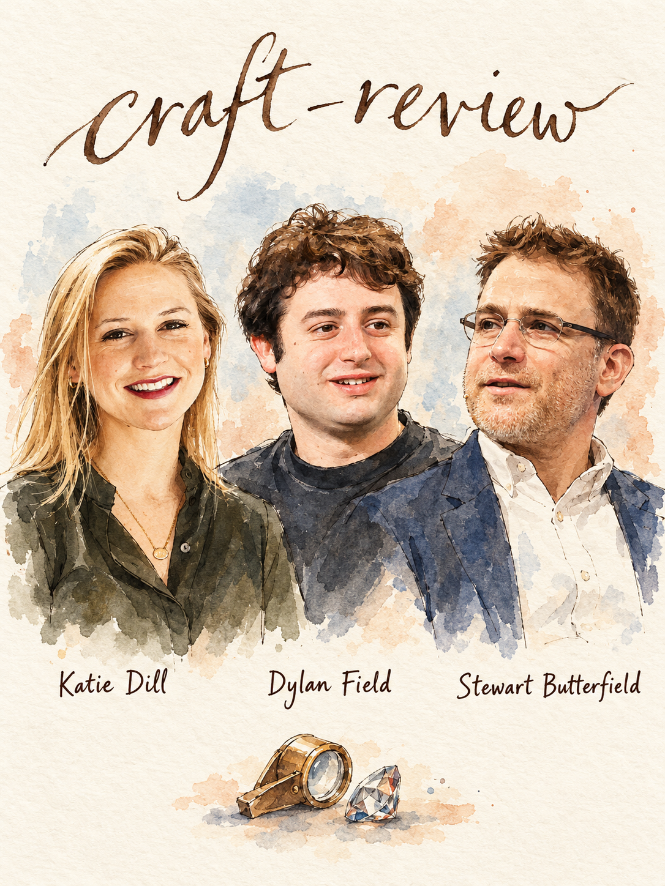

# Craft Review



Walk the product like a stranger, score it, and leave with a ranked fix list and a quality bar the team can repeat. Built from 264 insights from 100 Lenny's Podcast guests. **Lead team:** Katie Dill (Stripe's walk-the-store and PQR), Dylan Field (Figma: taste, complexity, play), Stewart Butterfield (Slack/Flickr: comprehension over friction).

## When to use
- You are about to ship and need to know whether it clears the bar (and which bar).
- Conversion, activation or bounce is poor and nobody can say why the page or flow fails.
- Many teams own pieces of one journey (sign up, pay, first value) and nobody owns the whole.
- Design critiques turn into comments on shades of blue, or reviews end with not quite right and no frame.
- A prototype, vibe-coded demo or AI-generated UI looks finished and people want to ship it.
- You are building an AI or agent surface (waiting, reasoning display, blank prompt box, follow-ups).
- You want to build your own or your team's taste, or define a quality bar that survives scaling.

## Step 1 - Diagnose (ask before answering)
If the user attached a URL, screenshots, a PRD, a repo or copy deck, read it first and infer what you can. Ask at most 4 of these:
1. **What exactly is under review?** One journey, one feature, a landing/onboarding page, an AI surface, or the org's bar itself. *Routes to the play in Step 2.*
2. **Who is the one specific user, and how strong and how specific is their intent?** Barely motivated stranger, or someone who already knows what they want to buy. *Decides friction vs comprehension (Butterfield).*
3. **Stage and stakes?** New category, crowded category, mission-critical (money, email, health), AI product with emergent behavior. *Sets how much polish before launch.*
4. **How many teams touch it, and who decides good enough today?** *Single owner: friction log. Many owners: walk the store plus calibration.*

If you can run the product (URL, local app, browser tool), drive it yourself as the named persona. If you only have a repo, audit strings, error messages, empty states, number of decisions per screen, and naming; say plainly that visual judgment needs screenshots.

## Step 2 - Pick the play
| If... (situation) | Use | From | Why |
|---|---|---|---|
| One person needs a fast verdict on a flow | **Friction log** with an explicit persona | David Singleton (Stripe) | Cheapest honest test; name the user or the notes are generic |
| Many teams own pieces of one journey | **Walk the store + Product Quality Review** | Katie Dill (Stripe) | Gives ~15 journeys a trio owner, a score and a debate |
| Page or onboarding loses people in seconds | **Comprehension audit** (intent x specificity) | Stewart Butterfield | Most visitors are barely above threshold; confusion costs more than clicks |
| Team is too close to a mature product | **Study Group** or **complaint storm** | Jeff Weinstein; Noah Weiss | Forces outside-in eyes on entropy and lingo |
| Argument over how polished is enough | **Levels of quality** + **value, ease, joy triage** | Katie Dill; Julie Zhuo | Ties polish to user expectation and to what is proven |
| Complexity creeping in, feature bloat | **Irreducible complexity audit** | Dylan Field; Uri Levine; Casey Winters | Adding can make the system worse; remove, hide, or segment |
| AI or agent surface | **AI UX checklist** | Kevin Weil; Aparna Chennapragada; Howie Liu; Roman Ugarte | Waiting, reasoning display, blank box, follow-ups need explicit design |
| Org cannot agree what good looks like | **Taste bar**: binary triage or tenets | Varun Parmar; Bob Baxley; Noah Weiss | Shows examples and settles recurring debates instead of writing a quality doc |
| Polished prototype is being treated as ready | **State the stage** before critique | Julie Zhuo; Andrew Ambrosino | Stops over-anchoring on an exploration |

## Step 3 - Run it

### Play A: Friction log + color score (Singleton, Dill)
1. Write the task in one line (*what this person wants to accomplish*) and name the user you are modeling: role, context, how motivated. Singleton: the persona must be explicit or the log is generic.
2. Do the real end-to-end flow the user would, across surfaces: search or ad, website, docs, signup, dashboard, email. Do not skip the seams between teams.
3. Keep a running stream-of-consciousness log. Tag every moment: **nice touch**, **fix**, or severity up to **P0 bug**. Screenshot each. Praise what is good too.
4. Hit the high-stakes moments hard: stuck, error, empty state, permission denied, payment failed. Singleton: be meticulous where users are stuck, not everywhere. Check that each error links to the exact fix.
5. Score the journey with a color, not a number (Dill): rate usability, utility, desirability and surprisingly great, then summarize as green, yellow-green, yellow or red. The point is judgment, not false precision.
6. Do it multidisciplinary: at bare minimum engineer, PM and designer together, because each notices different flaws (load time, copy inconsistency, design-system violations).
7. Done when: every P0/fix has an owner, the color is justified in two sentences, and the log names the single moment a stranger would quit.

### Play B: Walk the store + PQR (Katie Dill)
1. Pick about 15 critical user journeys. Give each an engineering, product and design leader trio.
2. On a regular cadence each trio walks its journey (Play A) and files bugs with the owning teams.
3. Hold a Product Quality Review: a small multidisciplinary room (design, eng, product/business leaders, include product marketing). Each journey team presents what they experienced and why they scored it yellow or yellow-green. Large rooms kill the debate.
4. Calibrate scores across leaders the way managers calibrate performance reviews, then adjust urgency.
5. Route findings into the normal bug system with craft tags and a light SLA (Jeff Weinstein: a P0 craft bug is acknowledged within seven days; teams may relabel severity to keep ownership).
6. Limits: it does not replace user research or data.

### Play C: Comprehension audit (Butterfield)
1. Place the user on two axes: strength of intent and specificity of intent. High on both (buying specific concert tickets): remove friction. Partial intent (a T-shirt, ~70%): minimize checkout friction. Low specificity (a new category): invest in comprehension.
2. Run the regular-person test: stop, breathe, pretend you have no context and a messy day. Ask three things of every screen: what is this, what do I do next, what happens if I do it?
3. Count decisions, not clicks. Eight trivial taps beat two fraught ones. Put the 1-3 things most users want up front and everything else behind Other (the early Uber pattern).
4. Any forced choice the user cannot understand makes them feel stupid (Don't Make Me Think, echoed by Tobi Lutke). Replace it with a default, or explain the consequence before asking.
5. Where one person's action costs everyone (the @everyone flag), add a cost-surfacing confirmation that states the real impact.
6. Check for owner's delusion: the visitor did not pay for a seat at your play. Have someone outside the team review in a fraction of a second.
7. Done when: a stranger can state what the thing is and the next action without help.

### Play D: Study Group / complaint storm (Weinstein, Weiss)
1. Gather 4-8 people from any function. Invent a company, a CEO and a goal.
2. Rule 1: you do not work here; no internal knowledge, the facilitator pauses violations. Rule 2: no solutioning, critiquing or bug filing during the session.
3. Use the product slowly for 60-90 minutes. Afterwards funnel findings into existing bug/SLA processes.
4. Complaint-storm variant (Weiss): project the journey on one screen, start with an adjacent product, then yours, and have everyone log every confusing or stopping moment.
5. Cheaper alternatives, in order (Weinstein): be your own customer, sit next to a customer, pantomime one.

### Play E: Irreducible complexity audit (Field, Levine, Winters)
1. List features and their usage. Field: one plus one sometimes equals one and a half; judge the whole system, not each local decision.
2. Remove what nobody uses (Levine). Un-bundle, progressively disclose, add training wheels, or segment by user type (Winters; note segmentation failed at Eventbrite with shifting creators).
3. Hold the line: keep simple things simple, make the complex things possible. Everyone owns simplicity, not just leaders.
4. Before adding, ask whether this is Better (all existing users would say yes) or New (Mark Pincus: 10 out of 10, not you).

### Play F: AI and agent surface checklist
- **Wait time.** Seconds vs minutes (Kevin Weil): for ~25-minute tasks design for the user leaving and a notification on return; for 10-25 second waits show short summarized progress, not silence and not raw babble.
- **Show the work, calibrated** (Aparna Chennapragada): too verbose feels like scripts running, too terse erodes confidence. Roman Ugarte hides tool calls and shows typing indicator plus progressive updates; Weil settled on one-to-two-sentence reasoning summaries at consumer scale. Developers may want more.
- **Blank box** (Benedict Evans, Howie Liu, Ian Silber): wrap AI in specific use cases, make capabilities visible with affordances, offer tappable follow-ups, design suggested next steps and cap them.
- **Capabilities over pixels** (Ugarte): write the launch line as can now X, not now has a button.
- **Preview before diff** (Alexander Embiricos): order what the user sees by what builds trust fastest.
- **Real messy inputs** (Bret Taylor): review AI output across the distribution of inputs, not the best case. Read outputs as the recipient; generic-but-correct is a failure (Hamel Husain's recruiting-email story).
- **Polish timing:** polish model output and critical basics first; polish emergent surfaces after you see usage (Nick Turley).

### Play G: Build the taste bar (Field, Parmar, Baxley, Weiss)
1. **Binary monthly triage** (Parmar): design leaders classify everything shipped that month as high quality or not, record why, and share the examples so everyone pattern-matches.
2. **Tenets, not platitudes** (Baxley): find debates the team keeps repeating, decide once, write 3-4 opinionated tenets (nobody argues against simple or clear). Example: documentation is a failure state.
3. **Distill the founder's taste** (Weiss): turn repeated founder feedback into principles that become the review language; avoid Goldilocks reviews.
4. **Name the small group** that holds the bar and reviews releases in depth (Archie Abrams), and an editor who can say almost, but no (Dill).
5. **Train your own taste** (Field's taste loop): experience, ask do I like it and why, learn the canon, articulate a framework. Add exposure hours watching real users (Guillermo Rauch).

## Where the experts disagree
- **Polish before launch** (Katie Dill, Rahul Vohra for mission-critical email, Dmitry Zlokazov: Revolut founders review 100% of screens) vs **ship raw, polish later** (Nick Turley for AI, Karri Saarinen: ship internally in week one, polish at general release). *Use polish-first when money, trust or a crowded category is at stake; ship raw when behavior is emergent and you cannot know what to polish.* Default: polish the core value and critical basics before launch; polish emergent surfaces after usage.
- **Remove friction and clicks** (Nikita Bier: every tap is a miracle; Scott Belsky: accept 10% confused to move 90% faster) vs **comprehension over clicks** (Stewart Butterfield; Noah Weiss: more clicks can be okay; Jackson Shuttleworth: preselecting a goal lost because choosing was the engagement). *Remove friction where intent is high and specific (checkout, auth); add or keep it where it builds understanding or commitment.* Default: audit comprehension first, then clicks.
- **The design process is dead** (Jenny Wen: scrappy shipped versions beat mocks) vs **it compresses but stays** (Elizabeth Stone, Ian Silber, Andrew Ambrosino: keep the process overlay, know your stage). *Wen fits AI-forward teams with engineers already shipping fast; Stone fits top-priority, large-scale consumer work.* Default: compress the tooling, keep a named stage and a feedback loop.
- **How to define quality**: rubric and calibration (Katie Dill) vs binary good-or-not examples (Varun Parmar) vs no KPIs, a small taste group (Archie Abrams). *Rubric fits many teams and journeys; binary fits orgs stuck defining quality; taste-group fits founder-led product with a strong bar.* Default: color score per journey, plus a monthly binary review for calibration.

## Deliverable
```markdown
# Craft Review: <journey / feature>   Date / reviewers:
**User modeled:** <who, intent strength, intent specificity>   **Stakes/stage:** <...>
**Verdict color:** green / yellow-green / yellow / red - <two-sentence justification>

## Journey walk (friction log)
| # | Step | What I wanted | What happened | Tag (nice touch / fix / P0) | Owner |
## Moment a stranger quits: <one line>

## Scores (usability, utility, desirability, surprisingly great)
## Comprehension check: what is it / next action / consequence - pass or fail per screen
## Value > ease > joy: top issue in each layer
## Complexity: decisions per screen, features to cut/hide
## AI surface (if any): wait UX, reasoning display, blank-box fix
## Bar for this stage: <which quality level, why>

## Top fixes (ranked)  | fix | evidence | guest/framework | owner | date |

## Next 3 actions
1. <fix the P0 / quit moment, owner, date>
2. <schedule the next walk or PQR, who is in the room>
3. <one rule or example added to the taste bar>
```

## Grade existing work
Score each 1 / 3 / 5, then total out of 40. Return the top 3 fixes with the guest behind each.
| Criterion | 1 | 3 | 5 |
|---|---|---|---|
| Journey walked end to end (Dill, Singleton) | Single screen reviewed | Main flow, one team, generic user | Cross-surface walk as a named persona, multidisciplinary, tagged log |
| Comprehension (Butterfield) | Stranger cannot say what it is | Clear what, unclear next step or consequence | What, next step and consequence obvious in a glance |
| Core value first (Zhuo) | Polish debated before value proven | Value assumed | Value, ease, joy triaged in order for a named user |
| High-stakes moments (Singleton) | Errors and empty states are defaults | Handled but generic | Errors link to the fix; edge cases outweigh the main path in effort |
| Complexity and cohesion (Field, Baxley) | Features bolted on, mixed patterns | Mostly consistent | One mind; unused features removed; defaults over decisions |
| Taste and distinctiveness (Field, Komoroske) | Looks like the LLM or template default | Tidy but generic | Opinionated point of view, resonates with the target user |
| Real inputs and states (Taylor) | Shown with perfect mock data | Some realistic data | Reviewed with messy production-like data and varied lengths |
| Quality bar and calibration (Dill, Parmar) | No stated bar | Bar in a doc nobody uses | Scored, calibrated across leaders, with shared examples |

## Red flags
- Reviewing screenshots only. Howie Liu: you cannot taste the soup without touching the product and the model.
- Owner's delusion: designing for people who care as much as you do (Butterfield).
- Tuning clicks while users still do not know what the product is (Butterfield).
- One star hire or QA as the quality plan. Dill: quality needs shared care, an editor and a journey lens.
- A polished prototype read as a ready product (Ambrosino); critique on shades of blue at the wrong stage (Zhuo).
- Platitude principles like simple and fast that no one would argue against (Baxley).
- Craft used as an excuse to avoid feedback (Eric Ries) or perfectionism that never ships (Seth Godin, Saarinen).
- Clever custom icons and novel naming where a standard works (Robby Stein).
- Designing for everyone: shipping Frankensteins from mixed design languages (Elizabeth Stone, Chennapragada).
- Core flows built once and never revisited while user standards rise (Butterfield's divine discontent).
- Decide by consensus instead of synthesis around the target user (Zhuo).

## Receipts
- "Those 15 things then each have engineering, product and design leaders that are responsible for the quality of those products. They review these journeys, what we call walk the store, where they review them as if they're walking the floor of their store on a regular cadence" — Katie Dill, Lenny's Podcast (00:35:20)
- "It's not meant to be an objective quantitative score. It is qualitative, it is judgment." — Katie Dill, Lenny's Podcast (00:45:42)
- "What we had to worry about was creating comprehension and in two senses, what is this thing? And what am I supposed to do next?" — Stewart Butterfield, Lenny's Podcast (00:32:34)
- "They're not subjects who paid money to go to your play and are sitting in the audience and waiting for that curtain to go out. They're people who are going to bounce in a fraction of a second." — Stewart Butterfield, Lenny's Podcast (01:28:41)
- "I think a lot of people can basically match a framework, not many people can create the framework." — Dylan Field, Lenny's Podcast (01:01:12)
- "Quality is not luxury. Quality is not perfection. Quality means meeting spec, and if you meet spec, you're done." — Seth Godin, Lenny's Podcast (06:46)

## Go deeper
- `references/frameworks.md` - every framework in this skill, how to run it
- `references/quotes.md` - verified quotes with timestamps
- Related skills:
  - `spec` - hand off when the review shows the problem is unshaped scope, not polish.
  - `experiment` - hand off when a fix needs a trustworthy test before rollout.
  - `ai-prototype` - hand off when you need to build a variant fast to feel it.
  - `eval-plan` - hand off when AI output quality, not UI, is the failure.
