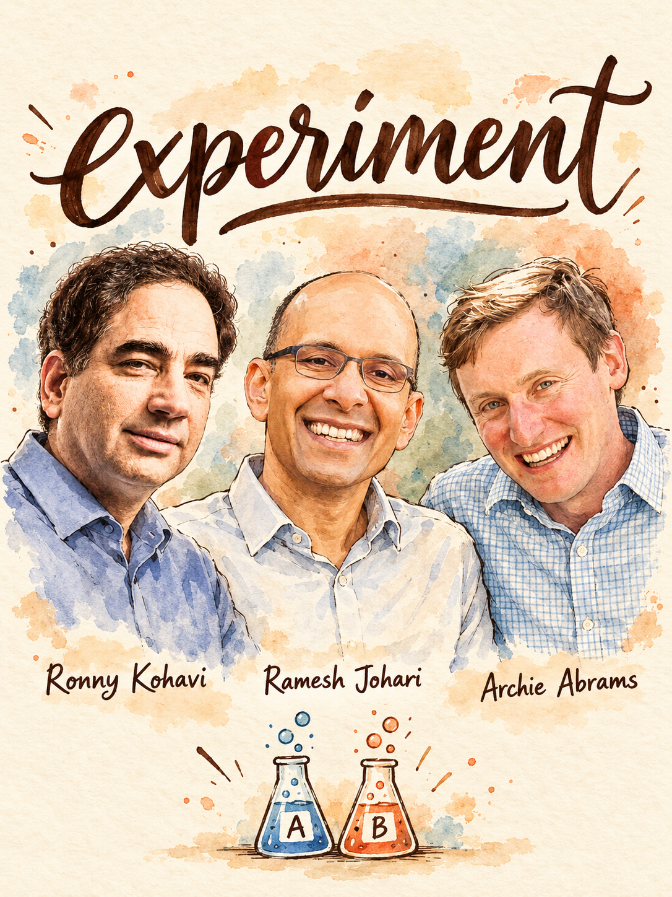

# Experiment: design it, trust it, read it out



Turn an idea into a pre-registered experiment, catch the ways it can lie to you, and end with a decision you can defend. Built from 191 insights from 71 Lenny's Podcast guests. **Lead team:** Ronny Kohavi, Ramesh Johari, Archie Abrams.

## When to use
- Someone says *let's A/B test it* and you need a design, sample size, metrics and duration.
- A result just landed and it looks too good, too flat, or contradicts what you know.
- You have too little traffic (B2B, marketplace, new product) and need a method that still produces a decision.
- A short-term win needs a durability check (holdout, lookback, retention proxy).
- Your team runs lots of tests but wins are small, win rate is odd, or learnings vanish.
- You are testing something that is not a normal funnel: paid media, pricing, an AI feature, a redesign.
- You have a test plan, PRD section or readout and want it graded.

## Step 1: Diagnose (ask before answering)
If the user attached a test plan, readout, CSV or dashboard export, read it first and infer answers. Ask at most 4:
1. **What decision will this change, and how reversible is it?** Routes to the gate (test, ship with holdout, or decide by judgment) and to how strict the threshold must be.
2. **Weekly eligible users and baseline rate of the primary metric?** Routes to normal A/B vs the low-volume plays. Kohavi's rule of thumb is about 200,000 users to detect 5% effects on a retail conversion metric; Elena Verna says if you cannot collect the sample in a month, do not A/B test.
3. **What surface is it?** Consumer or PLG funnel, marketplace or network effects, B2B low volume, paid channel, AI feature, redesign. Each has its own trap.
4. **Design, readout or audit?** And do you have a platform with automatic checks (SRM, A/A) or a spreadsheet? Routes to how much trust checking you must do by hand.

## Step 2: Pick the play
| If... (situation) | Use | From | Why |
|---|---|---|---|
| Unsure an A/B test is worth running at all | **A. Gate** | Lauryn Isford, Stewart Butterfield, Elena Verna | Tests cost engineer, analyst and PM time; skip when cost beats upside or sample is unreachable |
| Normal funnel, enough traffic | **B. Design brief** | Ronny Kohavi, Chris Miller, Laura Schaffer | Write hypothesis, metrics, power and stopping rule before launch |
| A result is in hand, especially a great one | **C. Trust checklist** | Ronny Kohavi, Shaun Clowes, Mayur Kamat | SRM, Twyman's law, peeking, false positive risk, upstream/downstream check |
| Need ship / hold / replicate | **D. Readout and decision rules** | Kohavi, Jackson Shuttleworth, Archie Abrams, Ramesh Johari | Neutral, borderline and surprising results each have a rule |
| Short-term lift, unsure it lasts | **E. Holdouts and lookbacks** | Archie Abrams, Shaun Clowes, Sri Batchu | A third or more of early lifts vanish at Shopify |
| Low volume, B2B, or sample not reachable | **F. Small-N toolkit** | Brian Tolkin, Sri Batchu, Elena Verna, Crystal Widjaja | Power analysis, then pre/post, diff-in-diff, maximum-treatment tests |
| Paid media, marketplace, or network effects | **G. Incrementality and geo splits** | Timothy Davis, Yuriy Timen, Anuj Rathi, Naomi Ionita | User-level buckets leak or attribution lies |
| Idea is expensive to build | **H. Cheap validation ladder** | Crystal Widjaja, Laura Schaffer, Teresa Torres | A/B testing is among the most expensive ways to validate |
| Program has low win rate or only incremental wins | **I. Portfolio and learning loop** | Ramesh Johari, Adriel Frederick, Chris Miller, Ben Williams | Reward learning, mix cannonballs with small bets |
| AI feature | **J. AI experiment rules** | Shreya Shankar, Grant Lee, Nicole Forsgren | Error analysis before A/B; test models per step |

## Step 3: Run it

### A. Gate: should this be an A/B test?
1. Ask Isford's two questions: do we need precise metric impact, or is the change risky enough to need protection? If neither, ship without an experiment and measure afterward.
2. Estimate the maximum plausible upside of the change vs the full cost of testing it (flags, instrumentation, dashboards, analysis, meetings). If cost exceeds upside, decide by judgment (Butterfield).
3. Estimate whether the required sample arrives in about a month. If not, go to play F (Verna).
4. Test regardless of opinion when the platform is cheap, the idea is cheap to build and we are bad at predicting outcomes (Kohavi's Bing ad title change sat in the backlog for months, then lifted revenue about 12%).
5. Ship without a test only if customer and data analysis say it is clearly net good, and add a safety net: pre/post plus a small holdout (Isford, Luc Levesque, Nilan Peiris). Skipping tests never excuses skipping rigor.
6. Early product, tiny traffic: build the big known pieces, do not test every little thing; the cost of experimentation is time (Adriel Frederick).

### B. Design the experiment brief
1. **Hypothesis before build.** One sentence: *because we saw X, changing Y will move Z by about N.* A test with no hypothesis leaves you stuck with B when A beats B (Brian Chesky). Write the predicted effect now; you need it for the surprise score later (Kohavi).
2. **Metrics.** One primary metric tied to a business outcome (revenue, margin, subscriptions), not clicks alone (Naomi Ionita). Add guardrails; an onboarding win that costs 10% of revenue must be visible (Isford). If retention takes months, name an early proxy, e.g. time to first patron or first $100 processed (Adam Fishman). Report absolute users gained, and for retention look for day-14 impact above day-1 (Shuttleworth).
3. **Power.** Compute minimum detectable effect, baseline, and runtime. Fix duration before launch (for example two weeks); do not stop when p first dips under 0.05. Be honest if the answer is six months (Tolkin). Reduce variance by capping skewed metrics and using CUPED so you need fewer users (Kohavi).
4. **Arms.** One factor per arm. Decompose redesigns into steps; of 17 changes, perhaps four are good (Kohavi). Use extra arms to isolate hypotheses, e.g. opt-out button separately from easier-goal fallback (Shuttleworth).
5. **Make the variant real.** Dogfood every variant before launch and confirm it contains the mechanism that makes the idea work. Duolingo's badge-for-signing-up test failed because it lacked what makes badges compelling, and cost roughly a year (Gina Gotthilf). Strip confounds so a failure cannot be blamed on execution (Nikita Bier).
6. **Ramp.** Roll out in a basket of smaller geos such as Canada or Australia (Naomi Ionita, Robby Stein). Keep pricing and promotion tests consistent across product, pricing page, stores and email.
7. **Redesign?** Forecast a dip at launch and budget two to six months of optimization; do not judge on the seven-day readout (Verna).
8. **Pre-register the decision rule:** what result ships, what holds, what gets replicated. Setting the validation plan after seeing data makes teams fit data to the hypothesis (Schaffer).

### C. Trust checklist (run before anyone reads the lift)
1. **SRM.** Compare the observed split to the intended one with a chi-square test. If improbable, results are invalid; about 8% of Microsoft experiments had SRM. Debug bots, pipeline filters, side-campaign traffic, assignment placement (Kohavi).
2. **Instrumentation.** Run A/A tests to validate the statistics; sanity-check metric definitions (one team had retention configured backwards so every win looked like a loss; Albert Cheng). About 10% of experiments are aborted on day one for bugs (Kohavi).
3. **Twyman's law.** Normal movement under 1% and you see 10%? Treat it as a bug until proven otherwise; about nine of ten times a flaw turns up (Kohavi).
4. **Peeking.** Live p-values with stop-on-significance inflate false positives to around 30%. Use the fixed horizon or a sequential method built for peeking (Kohavi).
5. **False positive risk.** With an 8% prior success rate, p below 0.05 means a 26% chance of a false positive (Kohavi). Compute it from your own win rate. For p between 0.01 and 0.05, replicate and combine with Fisher's or Stouffer's method; require lower p-values for results you broadcast.
6. **Before, after, one click up.** What happened upstream? Does it persist downstream (week-three churn)? Does the lift cover only 2% of traffic or lower revenue per customer? (Shaun Clowes).
7. **Cohorts, not blended pre/post.** Compare variant vs control; a conversion drop from a Bitcoin crash looks like a product bug in pre/post (Mayur Kamat).
8. **Weigh priors.** One stat-sig result does not overturn what you know about the business; replicate (Ramesh Johari, Jason Cohen on base rates).

Make failures impossible to ignore: Microsoft escalated from a banner to a blank scorecard to red numbers on every metric so screenshots carry the warning (Kohavi).

### D. Readout and decision rules
| Result | Default call | Source |
|---|---|---|
| Any trust check fails | Invalid; fix and rerun | Kohavi |
| Clear win, passes checks, guardrails clean | Ship, keep a holdout, schedule re-reads | Abrams, Clowes |
| Borderline win (0.01 < p < 0.05), low prior | Replicate, combine p-values | Kohavi |
| Up-funnel lift, long-term data not available | Ship, but discount claimed impact | Abrams |
| Neutral, adds UI or cognitive load | Shut it down | Shuttleworth |
| Neutral, you have real conviction it opens a roadmap | Ship the variant you would build from a blank slate, watch the holdout | Abrams, Shuttleworth |
| Flat, effort already spent | Do not ship to keep morale up | Kohavi |
| Negative on a guardrail | Go deep on why before any decision | Isford |
| Surprising (predicted vs actual far apart) | Investigate, replicate, add to the surprise review | Kohavi |
After the call, ask research why it happened; A/B tests give the causal claim, not the reason (Judd Antin). Log hypothesis, prediction, result and learning in a searchable history.

### E. Holdouts and long-term lookbacks
1. Run two layers: a global holdout across all changes (Abrams uses 5% per quarter; Clowes keeps 10% who never see any experiment) and per-surface long-term holdouts (Batchu).
2. For new-user changes, split 50/50 for a few weeks, ship the winner, keep tracking the originally assigned cohort for a year (Abrams).
3. Call at about three weeks, keep the group held, auto-ping owners at 3, 6, 9 and 12 months.
4. Classify what you find: pull-forward or low-value users, flipped effect, or a hidden pocket of valuable users (Abrams). Churn-prevention lifts from people who were not committed are the classic fool's gold.
5. Do not assume a non-persistent lift means the test failed; compare same-vintage cohorts against the holdout (Clowes).
6. For retention, measure return at 30, 60 and 90 days, not same-session purchase (Tim Holley).

### F. Small-N toolkit (B2B, low volume, new product)
1. Run the power analysis first. If runtime is acceptable, even six months for an important test, run it (Brian Tolkin).
2. Otherwise pick: pre/post with staged readouts at 24 hours, 7 days and 28 days and a rollback plan (Verna); observational data, diff-in-diff, sister or twin cities, geo segmentation; or 80% confidence where false positives are cheap (Tolkin, Schaffer).
3. For costly cross-functional bets, **maximize the treatment**: throw every plausible tactic at the hypothesis so a negative result is conclusive; if it works, prune for cost (Sri Batchu). Not for cheap web or email tweaks.
4. Pre-PMF: samples of 30 give direction, not precision (Crystal Widjaja); run two ideas in parallel for a fixed period and pick the one with more energy (Grant Lee).
5. If nothing gives signal, talk to more customers, then trust intuition and ship with a holdout (Tolkin).

### G. Incrementality and geo splits
1. Attribution cannot say whether converters would have converted anyway. Run geo or conversion-lift tests and compute an incrementality-adjusted factor per platform (Timothy Davis, Yuriy Timen). Worth the effort above roughly $50K/month of spend.
2. Marketplace buckets are connected by network effects, so user-level A/B can mislead (Anuj Rathi). Prefer market-level or geo splits and cohort comparison.
3. New paid channel: put in a small budget, look for a sign of life, then build the right creative and messaging before scaling (Davis). Time-box a new channel to one quarter (Adam Grenier).
4. Ad creative: two near-identical creatives in one ad set, one variable differing, compared on a leveling metric such as click-through rate (Jonathan Becker).

### H. Cheap validation ladder
Climb only as far as needed: assumption tests (half a dozen to a dozen per week across about three ideas; Teresa Torres) then painted door or designer mock, Wizard of Oz with manual fulfilment (Crystal Widjaja), an embarrassingly hacky MVP (Schaffer), then a real A/B test only for vetted ideas. Test the extremes first when a debate could drag on: tiny vs giant skip button (Lane Shackleton).

### I. Portfolio and learning loop
1. Expect to fail often: about two thirds at Microsoft, 85% at Bing, 92% at Airbnb search, more than half at Duolingo. If you win over 30-40%, you are probably betting small (Chris Miller).
2. Split effort: for example 80% on a few cannonballs and 20% on lead bullets (Adriel Frederick). Do not reward win counts; reward learning (Johari).
3. Run a weekly impact and learnings review focused on learnings, not activity (Ben Williams); a quarterly review of surprising experiments (Kohavi).
4. Alternate explore and exploit: when the share of non-significant results rises, you have exploited too far; brainstorm divergently (Albert Cheng).

### J. AI-feature experiments
1. Do error analysis before A/B testing; real failure modes are rarely the ones you imagined (Shreya Shankar).
2. Test models per workflow step rather than the most expensive model everywhere (Grant Lee).
3. Do not YOLO tests; plan data, instrumentation and analysis with AI, then check with data science (Nicole Forsgren).
4. Gate an agent replacing a human workflow on the same KPIs as the humans (Jeanne DeWitt Grosser).

## Where the experts disagree
1. **Test everything** (Ronny Kohavi, Carilu Dietrich, Laura Schaffer on running too few) vs **experiment selectively** (Lauryn Isford, Elena Verna, Stewart Butterfield, Karri Saarinen, Nilan Peiris). *Use A when platform cost is near zero, traffic is large and ideas are cheap; B when test cost dwarfs upside or sample is out of reach.* Default: test by default, skip by rule (play A), and never skip safety nets.
2. **Strict threshold, never ship flat** (Kohavi) vs **ship neutral on intuition / lower the confidence bar** (Archie Abrams, Laura Schaffer, Brian Tolkin). *Use strict for expensive, hard-to-reverse changes and low prior success rates; relaxed for cheap, reversible changes.* Default: relaxed bar only with a pre-written rule, qualitative corroboration and a holdout.
3. **Small N can still experiment** (Crystal Widjaja, Grant Lee, Teresa Torres) vs **no A/B below the sample** (Kohavi, Elena Verna). *Use A for direction and big effects pre-PMF; B for decisions where 0.1% matters.* Default: direction from small tests, decisions from power analysis.
4. **Inch-by-inch wins** (Kohavi, Jackson Shuttleworth) vs **bolder bets, fewer tests** (Ramesh Johari, Adriel Frederick, Chris Miller). *Use A on mature search/ranking surfaces; B when wins are stalling.* Default: 80/20 portfolio.

## Deliverable
Fill in and paste into the doc:
```markdown
# Experiment brief: <name>
**Decision this informs / reversibility:**
**Gate result (play A):** run A/B | pre-post + holdout | judgment (why)
**Hypothesis + predicted effect:**
**Primary metric / guardrails / early proxy:**
**Population, allocation, baseline, MDE, runtime (power calc):**
**Arms (one factor each) and dogfood check:**
**Stopping rule:** fixed horizon of __ ; no peeking
**Decision rule (pre-registered):** ship if __ ; hold if __ ; replicate if __
**Trust checks planned:** SRM, A/A, Twyman, FPR from our __% win rate
**Long-term plan:** holdout __%, re-reads at 3/6/9/12 months

# Readout
**Trust checks:** SRM __ | instrumentation __ | peeking __ | FPR __
**Result vs prediction (surprise score):**
**Before / after / one click up:**
**Call:** ship | hold | replicate | kill (rule applied)
**Why it happened (research input):**
**Learning logged:**

## Next 3 actions
1.
2.
3.
```

## Grade existing work
Score each 1 / 3 / 5, total out of 40. Output a score per criterion, the total, and the top 3 fixes with the guest behind each.
| Criterion | 1 | 3 | 5 |
|---|---|---|---|
| Gate fit | Everything tested by reflex | Some reasoning | Cost vs upside and sample reachability stated (Isford, Butterfield, Verna) |
| Hypothesis | None, or blue vs green | Stated after the fact | Written first with predicted effect (Chesky, Kohavi) |
| Metrics | Clicks only | Primary plus one guardrail | Business-tied primary, guardrails, retention proxy (Ionita, Isford, Fishman) |
| Power and duration | No calc | Calc but flexible stop | Calc, fixed horizon, variance reduction (Kohavi, Tolkin) |
| Trust checks | None | SRM only | SRM, A/A, Twyman, peeking, FPR (Kohavi) |
| Decision rule | Decided after seeing data | Partial | Pre-registered ship/hold/replicate (Schaffer) |
| Durability | Ship and forget | One follow-up | Holdout and 3/6/9/12 re-reads (Abrams) |
| Learning capture | Win/loss only | Notes in a doc | Searchable log, surprise review, why from research (Kohavi, Antin) |

## Red flags
- Stopping when p first dips under 0.05 (Kohavi).
- Reading 1 minus p as the chance the variant is better (Kohavi).
- Celebrating a 10% move when normal movement is under 1% (Kohavi's Twyman's law).
- Ignoring or overriding an SRM warning (Kohavi).
- A stat-sig result treated as a green light against everything you know (Johari).
- Whole-page redesigns with many changes and no hypothesis; you will not know why it failed (Melissa Tan, Kohavi).
- A minimum viable experiment missing the mechanism, then declaring the idea dead (Gina Gotthilf).
- A half-run B2B test, retried by every new executive (Sri Batchu).
- Blended pre/post across macro swings (Mayur Kamat).
- Trivial UI tests whose cost beats the upside (Butterfield); win-count incentives that breed incrementalism (Johari).
- Expecting an answer in a month when the test needs six, then pretending (Tolkin).

## Receipts
> "If you design the experiment to send 50% of users to control and 50% of users to treatment, it's supposed to be a random number, or a hash function. If you get something off from 50%, it's a red flag."
> — Ronny Kohavi, Lenny's Podcast (00:56:00)

> "If you're at Airbnb, or Airbnb search where the success rate is only 8%, if you get a statistically significant result with a P value less than 0.05, there is a 26% chance that this is a false positive result. It's not 5%, it's 26%."
> — Ronny Kohavi, Lenny's Podcast (01:04:10)

> "We call the experiment after three weeks, but in all cases, the group is held, we watch them."
> — Archie Abrams, Lenny's Podcast (00:35:29)

> "what people decide to test in a world that has promoted experimentation for everything tends to be more incremental by design."
> — Ramesh Johari, Lenny's Podcast (00:41:49)

> "My rule of thumb, if we cannot collect the sample size in the month, we shouldn't test it, period."
> — Elena Verna, Lenny's Podcast (01:07:52)

> "And of course, in retrospect, it led to no results, because no one is proud of signing up."
> — Gina Gotthilf, Lenny's Podcast (00:38:32)

## Go deeper
- `references/frameworks.md` — every framework in this skill, how to run it
- `references/quotes.md` — verified quotes with timestamps
- Related skills:
  - `metrics` — when the primary metric or guardrails are the real problem
  - `eval-plan` — for AI features, build the eval suite before or alongside the A/B test
  - `validate-idea` — when the question is whether to build, not which variant wins
  - `price` — for pricing tests, hand off the willingness-to-pay design
