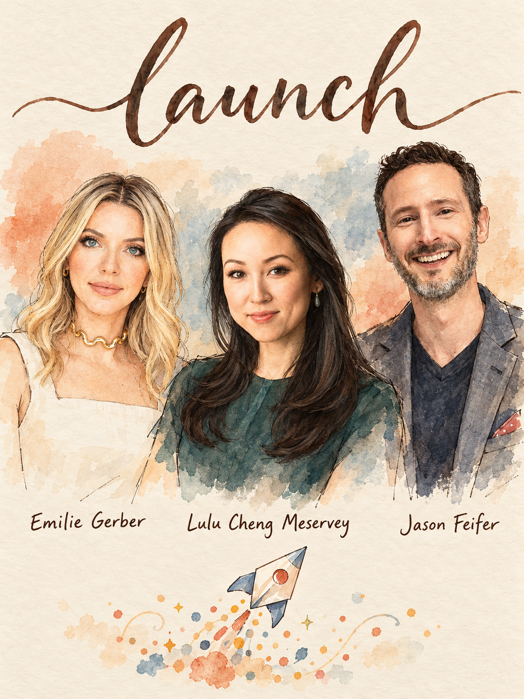

# Launch



Turn a product, feature or funding round into a launch plan with a story, an audience-by-audience distribution map and ready-to-send pitches. Built from 394 insights from 124 Lenny's Podcast guests. **Lead team:** Emilie Gerber, Lulu Cheng Meservey, Jason Feifer.

## When to use
- You are about to ship something and need the story, channels and timeline, not a generic checklist.
- You raised money or hit a milestone and want coverage (TechCrunch, Business Insider, podcasts, newsletters).
- You have no hard news and need an angle a reporter will take.
- Your announcement copy reads like marketing-speak and you want it rewritten.
- You are launching an AI feature and do not know how wide or how polished to go.
- Engineering ships continuously and marketing cannot keep up (or the reverse).
- You shipped and nobody noticed, and you want to know why.

## Step 1 — Diagnose (ask before answering)
If the user attached a PRD, draft announcement, pitch email, deck or landing page, read it first and only ask what it does not answer. Max 4 questions:
1. **What is this launch for?** Acquisition, recruiting, fundraising credibility, feedback, partners, team morale, SEO. *Routes everything: outlets, size, metrics (Ryan Hoover, Jason Feifer).*
2. **What is it and how uncertain is it?** New company, product or feature; AI with unknown capability; existing installed base; trust-sensitive. *Routes the rollout shape in Play 6.*
3. **Who must hear it, and what do you own?** Buyer vs user, B2B vs B2C, a founder or exec who can post, existing list or community. *Routes press vs going direct (Plays 3-5).*
4. **What hard news, proof and constraints exist?** Funding amount, revenue, named customers, own data, a fixed date, agency or budget. *Routes the hook and whether to wait for a reporter.*

## Step 2 — Pick the play
| If… (situation) | Use | From | Why |
|---|---|---|---|
| Funding or launch news, you want a TechCrunch-tier hit | Exclusive to the beat reporter, plain pitch, flexible date | Emilie Gerber, Arielle Jackson | Getting the first-choice reporter beats an earlier date |
| No hard news, niche or B2B product | Counter-consensus take, own data report, expert source, be part of the trend | Gerber, Feifer | Reporters need balance and an audience reason, not your product |
| Founder or exec willing to post; crowded category | Going direct + concentric circles | Lulu Cheng Meservey, Elena Verna | People trust people; each circle follows the inner one |
| AI product, capabilities unknown | Research preview, iterative deployment, hard-capped safety funnel | Cat Wu, Kevin Weil, Tanguy Crusson | You cannot know the use cases until people use it |
| Big installed base, enterprise, many internal teams | Customer zero + readiness digest + six-point plan | Marc Benioff, Christine Itwaru | Launches fail on internal readiness, not the blog post |
| Eng ships weekly | Soft launch / hard launch split, evergreen launch room, series of small launches | Janna Bastow, Cat Wu, Zoelle Egner | Decouples ship date from marketing plan |
| Message is mush or jargon | Second-grader test, whiteboard test, problem-first opener | Lulu Cheng Meservey, Max Schoening, Uri Levine | Cognitive burden kills spread |
| Challenger in a category dominated by an incumbent | Underdog framing, lightning strike, hero's journey | Gerber (Ramp vs Bill.com), Christopher Lochhead, Mike Maples Jr. | Matter loudly once rather than faintly all year |

## Step 3 — Run it
Run Plays 1-3 for every launch. Add 4, 5 or 6 per the table.

### Play 1 — Set the goal and size the launch
1. Write one goal sentence: *We are launching to ___ (acquire / recruit / raise credibility / get feedback / land partners / celebrate).* If you cannot say what the press is for, postpone pitching (Feifer). Do not launch for likes or upvotes (Hoover).
2. Size it. One anchor launch plus a smaller launch every ~2 months (Egner). Lochhead's lightning strikes: 1-2 big launches a year in B2B, 2-3 in B2C, more than that blurs into peanut butter. Marketing windows are finite: slipping a launch or skipping a changelog loses it (Nan Yu).
3. Run the readiness gate. Ask *is it great enough?*, not *is it good enough?* (Jag Duggal). Borderline on the Sean Ellis 'very disappointed' survey (~50%)? List the 3-5 things that get you decisively past it and find which cohorts already exceed 50%.
4. Look for demand signals before leaving stealth: people grab the laptop during demos, a few teams use it full-time (Claire Butler); original alpha group is very happy (David Singleton); for social products, internal usage explodes (Weil).
5. B2B and early? Harvest bottom-of-funnel demand for 6-8 months before awareness campaigns (Meltem Kuran Berkowitz). B2B press is third-party validation for sales, recruiting and sponsor emails, not signups (Gerber, Egner).
Done when: goal, size, gate result and 'what press is for' fit in 4 lines.

### Play 2 — Build the story
1. **Write the press release first** with only 3-4 tentpole features; cut anything that does not strengthen it (Tony Fadell). Story before product (Brian Chesky).
2. **Second-grader test** (Lulu Cheng Meservey): reduce to one sentence a second-grader could follow, strip cliches, convert to an analogy or image. Can a reporter repeat it in one sentence? If not, they cannot pitch it to their audience (Jackson).
3. **Open with the problem or user value**, not *our AI system is* (Uri Levine). Tell the why, not the what (Fadell). Use the customer's own words: ask references how they would describe it and put those words on the box (Christian Idiodi); Sean Ellis found the hook (*drowning in email?*) in the written 'why' answers.
4. **Whiteboard test** (Max Schoening): explain it as you would to a friend at a whiteboard, then compare to what you wrote.
5. **Find the five-second moment** (Matthew Dicks): the single second someone goes from X to Y; start the story as close to it as possible. For founder-press, find the counterintuitive decision that solved a business problem (Feifer's butter-dish maker who surveyed airport gates).
6. **Name the object of the new game** as a rallying question: *what would it take to turn every customer into a subscriber?* (Andy Raskin).
7. **Voice check**: could another company have written this? (Gina Gotthilf).
8. For each audience, build the **bridge** from what they already care about (X) to what you offer (Y) (Lulu's cultural erogenous zones). Do not try to change what they care about.
Done when: one sentence, one opener, one proof point, one human moment, one bridge per audience.

### Play 3 — Map audiences (the one-page comms plan)
1. List 5-6 audiences max. Rank by ability to influence your success and credibility to other groups.
2. For each: what they care about, which podcasts, conferences, subreddits, newsletters or Hacker News threads they use, and the message plus channel.
3. Sequence outward, no skipping circles: co-founders, execs, employees, investors, then power users, then everyone else. Each circle takes cues from the inner one (Lulu, concentric circles).
4. For each audience, start from their world as it is, not one pitch re-hosted for press, investors and employees (Maples).

### Play 4 — Run the press campaign
Start about 6 weeks out: blog post, investor quotes, images, media training, flexible date (Gerber).
1. **Pick outlets.** Audit where competitors were covered (Feifer). Match story to outlet: TechCrunch funding and product; Axios deals only (never a product announcement); Business Insider deck and journey stories; VentureBeat AI; Fast Company future of work and design; Forbes awards and contributors. Confirm the outlet has a beat reporter in your vertical. Consumer product? Pick consumer outlets: business titles reach people in a creating mindset, not a buying one. Local customers? Make them the heroes and pitch local press (Jackson).
2. **Decode the outlet.** Read 5+ recent stories, infer the mission, note formats (roundups, seasonal lists), click bylines. Pitch the writer covering your topic, not the editor in chief; check freelancers, who get fewer pitches and are hungrier (Feifer).
3. **Choose the hook.** Hard news: plain funding or launch exclusive with amount, space and investors. Funding alone is weak; bundle it with product live, named customers, momentum (Jackson). No hard news, pick one:
   - Counter-consensus take or op-ed when many pitch one stance (Gerber, Clockwise vs Shopify meetings)
   - Own data or survey report, repeated yearly (Feifer, Corcoran Report)
   - Underdog framing against an incumbent already in the news (Gerber, Ramp vs Bill.com)
   - Be part of the trend, offer yourself as the example (Feifer)
   - Expert source on breaking news, or a bylined piece (Feifer)
   - Personal founder angle for technical products (Gerber)
   - A bigger-than-you point of view (Egner)
4. **Write the pitch.** Subject line states the goal and names the column or show. Max 3 short paragraphs (Gerber's best pitches are 3 sentences). Lead with the story relevant to their audience. Mirror the show's structure. Reference something genuinely read. Or point out a gap in their coverage. Judged in a glance (Feifer).
5. **Protect the record.** Everything emailed is on the record, so send the hook first and the assets only after interest (Gerber).
6. **Cadence.** Offer exclusives, staggered across 1-6 reporters, transparently, with a fixed window (e.g. three hours head start) and never playing outlets against each other. Follow up after 3-4 days with new info. Move on after about a week; try 3-4 reporters. Email is default; do not call; DMs are a coin flip (Feifer).
7. **Assets.** Skip the $300-2,000 wire release; publish a first-person founder blog with all news elements, or a product-native launch page (Gamma: plain stat, short mission, customer love, bulleted investors, lead investor video). Give absolute scale, not 700% from a tiny base.
8. **Podcasts and newsletters** (every core plan): qualify by who they host and whether active; match spokesperson role to the show (a CFO for CFO podcasts); open with *are you open to guest ideas?*; expect ~1 opportunity per 20-30 sends; triage targets into perfect fit (custom note), mid (DM), long tail (light ask).
9. **After it lands.** Add 'as seen in' to sales, recruiting and partner emails; paid-promote to the exact audience you want to notice (Feifer). Measure response rates with and without it (Egner).
Done when: ranked target table, 3 customized pitches, assets staged, follow-up dates set.

### Play 5 — Go direct and seed communities
1. Choose one spokesperson and the one medium they are best at; pre-write 1-2 weeks of content; set a cadence; expand later (Lulu). Ghostwriting shows.
2. Start before you need it: if you never post and then suddenly do, people assume a crisis (Lulu). Give value first and bank goodwill (Grant Lee).
3. Launch-day asset by community: Product Hunt gallery as a visual story, human tagline, short maker comment (Ryan Hoover); founder-voice announcement in the early users' language, each founder posting their own reasons (Karri Saarinen); a demo video with the community's memes (Drew Houston).
4. Tailor per platform: tactical and metrics-backed on X; aspirational on LinkedIn (Lee).
5. No posting quota; post when you have something of value (Camille Ricketts).

### Play 6 — Roll out and get the company ready
1. **Choose the rollout shape.** Uncertain AI: label it a research preview, ship in a week or two (Cat Wu); the worst it will ever be (Jenny Wen). Trust at stake: hard-cap exposure, widen only when great (Crusson). Behavior change at scale: announce to admins weeks ahead, sensible org default, layered overrides (Stewart Butterfield). Creators: mock-up to ~10, pilot, invite-only lab of ~100 (Sachin Monga). Unknown real usage: opt-in Labs or small-market soft launch (Robby Stein, Peter Deng).
2. **Split soft from hard launch**: ship on engineering's date, then marketing plans the hard launch from a working product with videos and beta testimonials (Bastow). Standing launch room: dogfooded feature posted, docs, PMM and DevRel announce next day (Cat Wu).
3. **Close the readiness gap.** Revenue teams need a digest on what to do with it, not just that it is coming (Itwaru). PM shares what is built; marketing returns a brief with audience, channels, top-line messaging; PM weighs in before any content is written (Emily Kramer). A standard GTM template and one home for plans (Denise Tilles).
4. **Plan the leak**: when it leaks, what do we say, proactively or reactively (Adam Mosseri).
5. **Read days 1-3**, not day 1 (Eric Simons). Launch is not complete at code complete: audit shipped-but-unannounced features (Krithika Shankarraman). Use customer-zero numbers as the story (Benioff).

## Where the experts disagree
1. **Earned press** (Camille Ricketts, Gerber, Feifer) vs **go direct** (Drew Houston, Lulu, Verna). *Press wins for B2B credibility, recruiting and sales proof, and when you lack a following; direct wins when an exec has a voice and the category is crowded. Lulu's own stance: direct matters for all, media is one tool.* Default: sequence it, inner circle then direct then press, and treat coverage as a reusable asset.
2. **Ship rough** (Cat Wu, Boris Cherny, Weil, Tara Seshan) vs **hold until great** (Cameron Adams, Mark Pincus, Duggal). *Rough wins for AI with uncertain capability and tolerant dev or power users; great wins for flagships, consumer word-of-mouth and trust-sensitive products.* Default: research preview behind a hard cap, widen on proof (Crusson).
3. **Relationships don't matter** (Gerber) vs **get the writer to recognize your name** (Feifer). *Cold, well-targeted outreach for hard news; pre-warm the 3-5 writers you need for the long run.* Default: cold for the launch, warm for the series.
4. **One lightning strike** (Lochhead), **many small launches** (Egner), **launches don't matter** (Matt MacInnis, Jason Fried). *Strike when you have one ICP and a provocative angle; small series when you are early and community-driven.* Default: one anchor and a mini-launch every two months, with no success threshold you cannot control.

## Deliverable
```markdown
# Launch plan: <product / news>
**Goal:** We are launching to ___. **Size:** anchor / mini. **Gate:** great-enough result + signal.
## Story
- One sentence (second-grader test): ___
- Problem-first opener: ___   - Proof (customer zero / data): ___
- Human moment (5-second): ___   - Object of the new game (question): ___
## Audience circles (ranked)
| Circle | What they care about (bridge X to Y) | Where they read | Message | Channel | Date |
## Press plan
| Outlet | Writer (beat) | Hook | Exclusive order | Follow-up date |
## Pitch email (draft)
Subject: ___ (goal + column/show named)
3 short paragraphs, story first. Assets withheld until interest.
## Assets: first-person blog / launch page / demo video / PH gallery / quotes
## Rollout and readiness: shape; soft-vs-hard dates; revenue-team digest; PM-PMM brief; leak plan
## Timeline: T-6w assets + outreach start | T-2w exclusives | T-0 | T+1-3 read | T+30 recap
## Signals and metrics: day 1-3 net new, coverage used in sales/recruiting, response rate with/without press
## Next 3 actions
1. ___  2. ___  3. ___
```

## Grade existing work
Score a plan, announcement, pitch or landing page 1-5 per criterion. Return per-criterion score, total /40, top 3 fixes with the guest behind each.
| Criterion | 1 | 3 | 5 |
|---|---|---|---|
| Goal clarity (Feifer, Hoover) | No stated purpose | Goal named, outlets not tied to it | Goal drives outlet, size and metric |
| Story in one sentence (Lulu, Jackson) | Jargon or feature list | Clear but needs a paragraph | Second-grader clear, repeatable, image or analogy |
| Problem-first and customer words (Levine, Fadell) | Opens with the company or AI | Mixed | Opens with user problem in customers' language |
| Audience fit and targeting (Feifer, Gerber) | Blast list or top editor | Right outlet, wrong person | Beat writer or freelancer, format matched, competitor audit done |
| News hook and proof (Gerber) | Growth stats from a tiny base | Funding alone | Bundled hook: customers, data, underdog or counter-consensus take |
| Pitch craft (Feifer, Gerber) | Long, product-first | Targeted, 5+ paragraphs | Glance-test subject, 3 short paragraphs, assets withheld |
| Readiness and rollout (Duggal, Itwaru, Bastow) | Ship date equals launch | Marketing told late | Gate passed, staged exposure, revenue-team digest, leak plan |
| Distribution and after-launch (Lulu, Egner) | One channel, one shot | Coverage unused | Circles sequenced, as-seen-in reused, day 1-3 read, mini-launch calendar |

## Red flags
- Pitching because you feel you deserve coverage; journalists serve their audience, not you (Feifer).
- Paying for a wire press release or an agency that guarantees placement or sells distribution (Feifer, Gerber).
- Emailing the editor in chief, or the same pitch to everyone (Feifer).
- Funding announced as a straight funding story; expecting WSJ or NYT without valuation and revenue on the record (Jackson, Gerber).
- Relative growth stats from a tiny base, and attaching full materials before interest (Gerber).
- Expecting press to drive signups for a B2B product (Gerber, Egner).
- Speaking as a faceless corporation, or chasing virality for its own sake (Lulu).
- Launching and calling it done at code complete (Krithika Shankarraman).
- Copying another company's playbook without its inputs (Shankarraman).
- Flashy sponsorships and buzz stunts as a substitute for traction (Egner, Seth Godin).

## Receipts
> "Think about press the same way that you think about raising money, which is to say you do it when you know what the money is for, and you should do it when you know what the press is for." — Jason Feifer, Lenny's Podcast (00:09:02)

> "It's a light lift to take the thing you want to talk about and just shape it into, to fit into their worldview or their passions." — Lulu Cheng Meservey, Lenny's Podcast (00:14:54)

> "if you can optimize for the reporter over the timing, you're going to see such a better outcome because getting the first choice reporter is going to drive way more for your business than announcing it four days sooner." — Emilie Gerber, Lenny's Podcast (01:23:12)

> "So the two goals I always recommend to founders when thinking about using PR, are either hiring or maybe improving the response rate for your cold outbound." — Zoelle Egner, Lenny's Podcast (01:02:43)

> "your launch isn't complete if you're just code complete. You have to actually ship it to the customer and make them aware of it." — Krithika Shankarraman, Lenny's Podcast (00:25:41)

> "Good enough, isn't good enough. Is it great enough?" — Jag Duggal, Lenny's Podcast (00:19:58)

## Go deeper
- `references/frameworks.md` — every framework in this skill, how to run it
- `references/quotes.md` — verified quotes with timestamps
- Related skills:
  - `position` — run first if you cannot state who it is for and why it is better
  - `pmf-check` — run the Sean Ellis gate before a big launch
  - `growth-model` — after launch, diagnose activation and retention
  - `exec-comms` — turn the launch story into an exec update or talk
