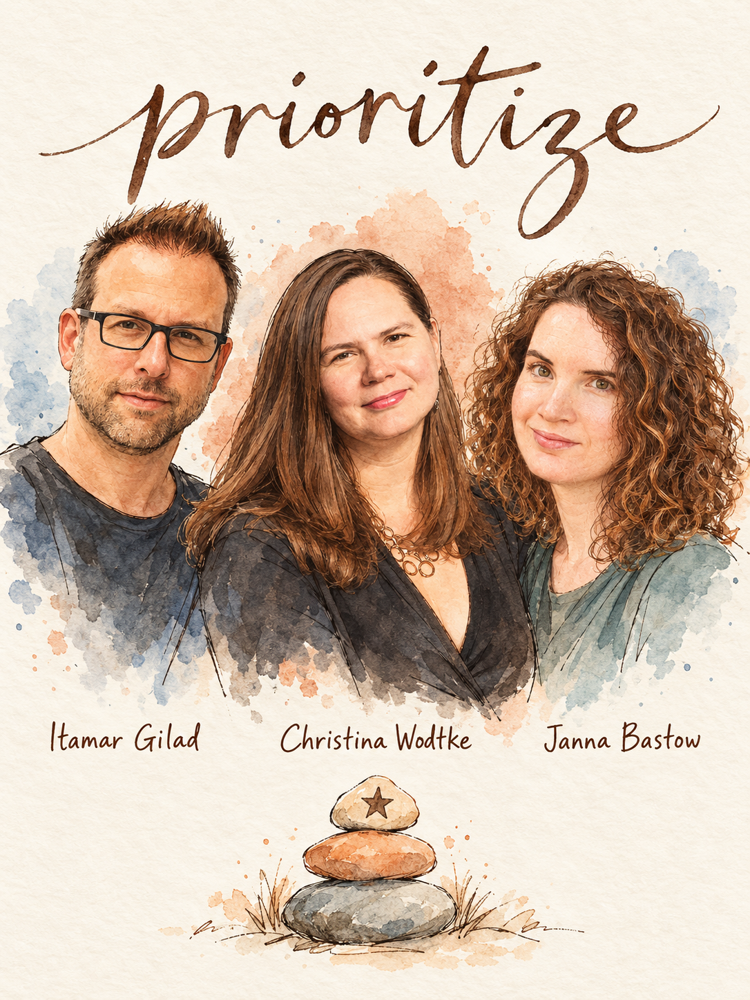

# Prioritize: Confidence-Scored Roadmap + Goals



Rank what to build by evidence instead of opinion, shape it into a roadmap that survives contact with reality, and set goals the whole team can recite. Built from 324 insights from 133 Lenny's Podcast guests. **Lead team:** Itamar Gilad, Christina Wodtke, Janna Bastow.

## When to use
- A backlog or idea list is bigger than capacity and opinions are fighting (founder, sales, competitors, research).
- You need a roadmap and stakeholders keep asking for dates.
- You are writing or rescuing OKRs / quarterly goals, or the team cannot name its top goal.
- Planning takes weeks and the plan is dead by week three.
- You cannot choose between two features of similar size.
- AI model capabilities keep shifting and a 6-12 month roadmap feels like fiction.
- You must split capacity between core work, tech debt, and bets.

## Step 1 - Diagnose (ask before answering)
If the user attached a backlog, roadmap, OKR doc or planning deck, read it first and infer as much as you can. Then ask at most 4 of these:
1. **What is the goal for the next quarter, in one sentence with a number?** No clear goal means no prioritization is possible (Matt LeMay, Ravi Mehta). If there is none, run the Goals play first.
2. **Stage and size?** Under ~50 people, seed stage: short cycles (Molly Graham, Gokul Rajaram). Scale-up or enterprise: allocation splits and cross-team forced ranking.
3. **Are there hard external dates or enterprise customers who demand a roadmap?** Routes you to dated project plans or the 80/50 rolling roadmap instead of pure Now-Next-Later.
4. **Is your product exposed to model-capability changes (AI)?** Routes you to short-horizon planning (JIT monthly, seasons) versus quarterly OKRs.

## Step 2 - Pick the play
| If... (situation) | Use | From | Why |
|---|---|---|---|
| Too many ideas, opinion battles | Confidence-scored ICE + Confidence Meter | Itamar Gilad (ICE originated with Sean Ellis) | Forces evidence into the score; stops gut feeling from posing as confidence |
| You have one numeric team goal | Impact in the same unit as the goal | Matt LeMay | Abstract scores lose the line to the goal |
| Stakeholders want dates, uncertainty is high | Now-Next-Later + outcome roadmap | Janna Bastow, Itamar Gilad | Granularity falls as certainty falls; dates only where required |
| Enterprise customers demand a roadmap review | Rolling 6-month roadmap, 80% / 50% commitment | Varun Parmar (Miro) | Satisfies buyers while keeping room to pivot |
| AI product, capability moves monthly | Work backwards from capability + JIT monthly plan | Nick Turley, Fiona Fung, Asha Sharma | Long roadmaps go stale in weeks |
| Writing or fixing OKRs | Objective + 'how do we know?' + triangulated KRs | Christina Wodtke | Outcome-based KRs, 3 max, weekly rhythm |
| You do not know how to move the metric | Frontier-of-understanding goals + execute/understand tracks | Ravi Mehta, Bangaly Kaba | Learning goals beat fake outcome commitments |
| Core vs debt vs bets fight for capacity | Allocation split (70/20/10, 60-30-10, 5-25-60, Four BBs) | Ken Norton, Shreyas Doshi, Ryan Salva, Anuj Rathi | Makes the trade-off a strategy call, not a per-ticket fight |
| Sales or execs inject requests mid-quarter | Strategy as escalation filter + sales feature budget | Shreyas Doshi, Jason Lemkin | Requests are judged against strategy or a capped budget |
| Teams chase the same top-line metric | Distinct goals one step from company goal | Ami Vora, Matt LeMay | Avoids toddler soccer and cascades that do not add up |

## Step 3 - Run it

### Play A: Confidence-scored backlog (Gilad, Ellis)
1. **Fix the goal first.** Write the top 1-3 goals with numbers. Anything that cannot be tied to one goes in an 'opportunity backlog' (Nan Yu keeps 20-30 problems not yet ready to build).
2. **Collect ideas from everyone** (founders, sales, competitors, research) but let the team choose which to test first (Gilad). Anyone proposes; the team scores.
3. **Score each idea:** Impact on the goal (best case, ideally in the goal's unit), Ease (inverse of effort), then Confidence in those two guesses. Fold Reach into Impact: Gilad and Sean Ellis both prefer ICE to RICE.
4. **Cap confidence by evidence type** (adapted from the Confidence Meter; Gilad's actual meter is a thermometer, this is a working simplification):
   - Own conviction, pitch deck, 'fits our strategy/AI theme': 0 to 0.1 out of 10, whatever the person feels.
   - Peer review, back-of-envelope estimates: still guesswork, barely above zero.
   - Anecdotal evidence, competitor has it, market data, surveys: low to medium.
   - Real tests with users (prototype, fake door, beta): medium to high. Only building and testing earns high confidence.
5. **Adjust after small tests.** Showed 12 customers, one liked it? Cut the Impact score, do not just lower Confidence (Gilad).
6. **Match investment to confidence.** Cheap tests first; skip heavy validation for low-risk changes like reordering settings (Gilad: know when to stop).
7. **Protect big bets from the RICE trap.** For high-reach, high-impact ideas, ignore C and E for about a week, sit with engineers and designers trying to solve it, then re-score (Vijay Iyengar).
8. **Willingness-to-pay check (optional, B2B/monetized).** Show 10 candidate features in subsets of 6 and ask most important (would pay) and least important (won't pay); rotate subsets (Madhavan Ramanujam). Roughly 20% of what you build drives 80% of WTP.
9. **Done when:** every top idea has a score, an evidence label, and a next validation step with an owner. Put those steps on a GIST board and review every other week (Gilad).

### Play B: Roadmap that does not lie
1. Draw three columns: **Now, Next, Later.** Place problems or outcomes, not features. Be less granular the further out (Bastow).
2. Put a date only on items with a real external reason (regulation, Christmas, school year). For those, plan earlier with buffer and aim to finish early enough for a soft launch (Bastow).
3. Write items as outcomes: *by October we want to achieve this outcome.* Move a concrete build onto the roadmap only after a high-confidence test (Gilad).
4. Add a line stating items may be pivoted or cut (Paige Costello); items on a roadmap otherwise harden into promises.
5. **Enterprise variant:** rolling six months, updated every three; commit about 80% of months 1-3 and about 50% of months 4-6 (Varun Parmar).
6. **Story test:** write the roadmap as themes with a why for each. Jiaona Zhang wants themes and a story, not a scored spreadsheet.
7. **Strategy drift test:** lay the roadmap against your top three strategic bets and count the share of resources committed to off-strategy items (Maggie Crowley found cases with 90%).
8. **Done when:** the Later column is problems, every date has a named external reason, and you can say which bet each Now item serves.

### Play C: Goals / OKRs (Wodtke + LeMay + Graham)
1. Check foundations: strategy, empowered teams, psychological safety. OKRs are a vitamin, not a medicine (Wodtke).
2. Write **one inspiring objective** for the quarter, motivating but not ridiculous.
3. Ask **how do we know?** List evidence, then convert to **three key results that triangulate**: one hard number, one quality or delight measure, one tied to money (Wodtke). Brainstorm measures for 10 minutes before choosing.
4. Test every KR: outcome or task? Rewrite tasks. A binary gate is acceptable only if it is genuinely hard to pass (Wodtke).
5. Keep the team goal **one step from the company goal**: link them with one Y statement or one operator, e.g. upgraded users times lifetime value (LeMay). If the intern-who-started-Monday cannot understand it, it fails (Molly Graham).
6. **One goal, one named owner**, and say which goal wins in a fight (Molly Graham). Max three company goals.
7. Set the target so it feels uncomfortable but not doomed; expect roughly 70% attainment (Wodtke). All-green means you sandbagged (Jiaona Zhang).
8. Leave next-quarter KRs blank until this quarter's results are in; write only objectives (Wodtke).
9. **Cadence:** Monday commit, Friday celebrate; weekly status with confidence per KR, last week, next week, max three P1s. Review top 2-3 initiatives per KR, about 10 minutes (Wodtke).
10. **Planning time cap:** no more than about 10% of the execution period (Lane Shackleton, Gustav Soderstrom): one week of planning in a ten-week quarter.
11. **End of quarter:** grade loosely, then retro deeply. Ask why you landed there; if you hit, check you know why (Wodtke, Ravi Mehta).
12. **Done when:** an engineer stopped in the hallway can recite the team goal (Yuhki Yamashita's test).

### Play D: When you cannot move the metric (Ravi Mehta, Bangaly Kaba)
1. Name the risk: **understanding** (levers unknown), **dependency** (missing tools), **execution** (cannot ship hypotheses fast), **strategic** (hypothesis may be wrong).
2. Set a goal that matches: understanding goal, a tooling goal, a count of experiments (e.g. 20), or a test of the hypothesis.
3. If leadership insists on an outcome, commit to it but stage the quarter: weeks of customer talks and analysis, then hypotheses, then execution. A miss then comes with a why and a higher-confidence next plan.
4. Run **execute + understand** in parallel each sprint: high-conviction items plus 3-4 understand projects. Early in a new domain Kaba started near 60% execution / 40% understand and shifted toward 80-85% execution.
5. For each theme ask: what do we know from data, and what must we first understand?

### Play E: Capacity split
1. Pick a template for your stage, then adjust:
   - **70/20/10** core / adjacent or strategic / bets (Ken Norton from Google, Eeke de Milliano; Ronny Kohavi: expect about 80% of big bets to fail).
   - **60-30-10** incrementals / one or two big initiatives / stability and infrastructure (Shreyas Doshi).
   - **5-25-60** bold bets / operations / payoff from earlier bets (Ryan Salva; not for startups).
   - **Four BBs:** Brilliant Basics, Bread and Butter, Big Bets, Breaking Bad. Ask for allocation of 100 points, write three alternatives with consequences, and make it a CEO + head-of-product strategy call (Anuj Rathi).
2. Growth teams: reserve 20-25% of annual time for new loops, with no metric goals at first (Elena Verna).
3. Do not quantify opportunity cost in a spreadsheet column. Name the ambiguous big bets you are tempted to skip and give them explicit room (Doshi).
4. **Done when:** the split is written down, one named owner defends the bets slice, and the allocation is revisited at the next planning cycle.

## Where the experts disagree
**1. Score ideas or do not.** *Score* (Gilad, Sean Ellis): scores let you explain to submitters why an idea lost. *Skip abstract scores* (Matt LeMay, Jiaona Zhang, Vijay Iyengar): LeMay says use the goal's unit; Zhang wants a story of themes; Iyengar shows RICE buries bold bets. Use scoring when many people submit ideas; use goal-unit estimates when you have one numeric goal. **Default:** ICE with Impact in the goal's unit, Confidence capped by evidence, and the ignore-C-and-E exception for big bets.

**2. OKRs or no OKRs.** *Use them* (Christina Wodtke, Nickey Skarstad, Ray Cao): a shared cross-functional goal framework brings strategy down to the quarter. *Drop them* (Jason Fried, Tobi Lutke, Geoff Charles, Keith Coleman, Archie Abrams): planning cost more than the work, and core product runs on taste. Wodtke herself says OKRs will not fix a broken company. Use OKRs when several functions must align and the team has a strategy; use a one-pager or milestone goals for small teams with short feedback loops. **Default:** a light OKR set (one objective, three KRs, weekly rhythm), capped at 10% planning time.

**3. How far ahead to plan.** *Rolling plans* (Bastow, Brian Chesky's two-year rolling roadmap, Paige Costello's rolling 12 months, Varun Parmar's six months): customers and go-to-market need predictability. *Near-zero roadmap* (Amjad Masad, Kevin Weil, Keith Rabois, Fiona Fung): model capability changes the possible set every month. Use rolling plans when partners or enterprise buyers depend on you; use JIT monthly planning with a themes refresh every six months when capability drives the roadmap. **Default:** Now-Next-Later with detail inversely proportional to horizon (Andrew Ambrosino).

**4. Fixed allocation or no quota.** *Fixed splits* (Norton, Doshi, Salva, Eeke de Milliano) make bets and maintenance survive planning. *No quota* (David Singleton, Katie Dill at Stripe): each team sizes polish and incident time itself, backed by judgment and quality culture. Use splits when the team is large or short-termism wins every fight; skip them when talent bar and trust are high. **Default:** a written split with a bets slice that is explicitly protected.

## Deliverable
Produce this, filled in, as a pasteable doc:
```markdown
# Priorities and Goals - <team>, <quarter>

## 1. Goals
- Objective: <inspiring, one sentence>
- KR1 (hard number): ...   KR2 (quality): ...   KR3 (money): ...
- Goal link: team goal -> company goal in one statement: <...>
- Owner (one name): <...>   Wins in a fight: <goal>

## 2. Capacity split
| Bucket | % | Why | Owner |

## 3. Scored ideas
| Idea | Impact (goal units) | Ease | Evidence type | Confidence (0-10) | Next validation step | Owner |

## 4. Roadmap (Now / Next / Later)
Now: <outcomes + date only if externally required>
Next: <problems>
Later: <struggles/problems, not features>
Pivot-or-cut note: <one line>

## 5. Not doing (and why)
- <idea> - fails <persona/strategy/confidence> filter

## 6. Rhythm
Weekly: Monday commit / Friday celebrate; status = KR confidence, last week, next week, max 3 P1s
Biweekly: GIST-board review of ideas and validation steps
Quarter end: loose grade + retro; next-quarter objectives only, KRs after results
Planning time cap: <10% of cycle>

## Next 3 actions
1. <who, what, by when>
2. ...
3. ...
```

## Grade existing work
Score each 1 / 3 / 5, total out of 40. Return the score per criterion, the total, and the top 3 fixes with the guest behind each.

| Criterion | 1 | 3 | 5 |
|---|---|---|---|
| Goal clarity (LeMay, Graham) | No stated goal, or 10+ goals | Goals exist but not numeric or not one step from company goal | 1-3 numeric goals, one owner each, one wins in a fight |
| Evidence-backed confidence (Gilad) | Confidence = how strongly people feel | Some tests, scores unlabeled | Every score has an evidence type; tests lift confidence |
| Outcome orientation (Wodtke, Perri) | KRs are tasks or activity goals | Mix of outcomes and tasks | All KRs are outcomes; triangulated hard/quality/money |
| Roadmap honesty (Bastow, Gilad) | Dated Gantt of features | Themes but dates everywhere | Now-Next-Later, dates only where external, pivot-or-cut stated |
| Focus (Daniel Lereya, Ebi Atawodi) | Cannot name the most meaningful thing shipped last quarter | 5+ priorities | 3-5 big rocks; list of not-doing exists |
| Portfolio balance (Norton, Doshi) | All quick wins, or all bets | Mix exists, unwritten | Written split with protected bets and debt |
| Strategy fit (Crowley, Doshi) | Roadmap bears no relation to strategy | Partial | Every item maps to a bet; escalations filtered through strategy |
| Cadence and cost (Shackleton, Wodtke) | Planning eats a month; no weekly rhythm | Cadence exists, heavy | Under 10% of cycle; weekly commit; loose grade + retro |

## Red flags
- **Confidence by conviction.** Every terrible idea had someone who thought it was great (Gilad).
- **Competitor has it, so validated.** Gilad: they do not know better than you.
- **Tasks as key results.** Wodtke calls this the biggest OKR mistake.
- **Goals layer used as a build plan.** Gilad: that is planning work, not goals.
- **Toddler soccer.** Every team gets the same top-line metric and runs to the same surface (Ami Vora).
- **Five safe wins, zero ambiguous bets.** Positive-ROI logic keeps teams busy (Shreyas Doshi).
- **Peanut-buttering resources** across many problems (Ebi Atawodi).
- **Rushed OKR rollout** delegated to HR; leaders skim the book then declare OKRs broken (Wodtke).
- **Cannot choose between two equal features.** Usually a missing strategy, not a scoring problem (Ravi Mehta).
- **Year-long sequential roadmap in AI products** (Keith Rabois) and promising dates to customers (Jason Fried).
- **All-green OKRs** mean sandbagging, and OKRs hit while users notice nothing different is the worst outcome (Jiaona Zhang).

## Receipts
- "Guess what? Behind every terrible idea that was ever someone thought it was great, that gives you 0.01 out of 10." — Itamar Gilad, Lenny's Podcast (00:38:47)
- "The further out you plan, the more you're making it up. We know this." — Janna Bastow, Lenny's Podcast (25:08)
- "So, making sure that you have real outcomes that let you move forward, I think that's the biggest mistake people make in OKRs." — Christina Wodtke, Lenny's Podcast (00:25:09)
- "if you don't have a clear and specific sense of what impact means, you can't really prioritize effectively." — Matt LeMay, Lenny's Podcast (01:02:26)
- "we convince ourselves that positive ROI is great. And so we make ourselves busy" — Shreyas Doshi, Lenny's Podcast (01:07:11)
- "two people owning a goal is no one owning a goal. One person owns the goal, who is it?" — Molly Graham, Lenny's Podcast (00:52:09)

## Go deeper
- `references/frameworks.md` - every framework in this skill, how to run it
- `references/quotes.md` - verified quotes with timestamps
- Related skills:
  - `strategy` - when you cannot choose between options because there is no strategy yet.
  - `metrics` - when goals need a north star and a metric tree to anchor KRs.
  - `experiment` - when a top-ranked idea needs a trustworthy test to raise its confidence.
  - `ai-product-bets` - when the question is which AI features to build as models improve.
  - `price` - when willingness to pay should decide the roadmap order.
