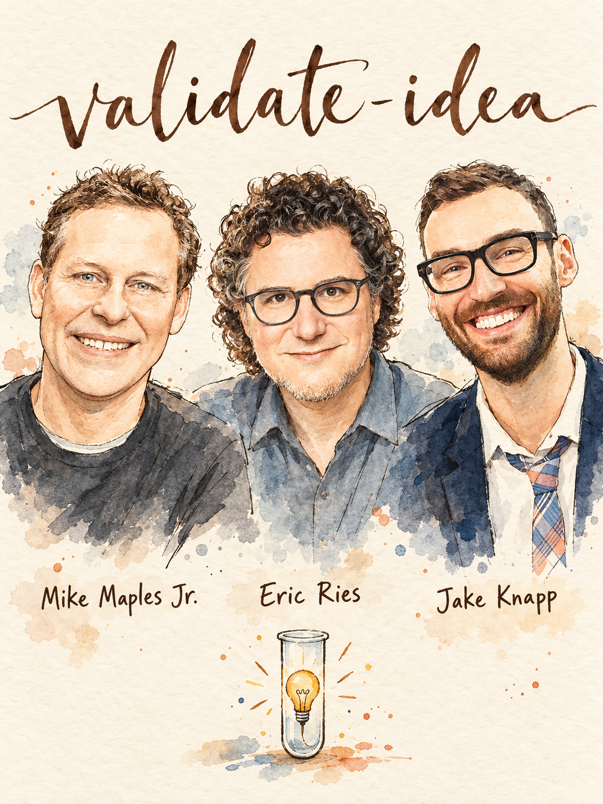

# Validate an Idea



Riskiest assumptions first, cheapest test next, a pre-committed kill line, then a decision, all before building. Built from 182 insights from 82 Lenny's Podcast guests. **Lead team:** Mike Maples Jr., Eric Ries, Jake Knapp.

## When to use
- A founder, PM or exec has an idea and asks *should we build it?*
- A PRD, pitch or roadmap item has no evidence section, or its evidence is 'users asked for it'.
- A team can't scope an MVP, or the MVP keeps growing.
- Early feedback is all positive and nobody can say what would change the plan.
- You need to decide between several ideas or wedges (side project, new bet inside a company, AI feature).
- Someone says 'customers would pay for this' and there is no payment, pre-order or invoice behind it.
- You want a one-week test plan (sprint, prototype, fake door, concierge) instead of a quarter of building.

## Step 1 — Diagnose (ask before answering)
If the user attached a PRD, pitch, survey, interview notes or repo, read it first and infer what you can. Ask at most 4 of these:
1. **What is the idea in one sentence, who is the customer, and what do they do today instead?** *Why:* no named customer or alternative means you start with the Foundation Sprint, not tests.
2. **What do you already have: lived pain, paying customers, usage data, a prototype?** *Why:* sets how far right on the evidence ladder you start (Gilad: start left, escalate only on positive evidence).
3. **Is this zero-to-one (new category) or a better version of something that exists, and is it B2B, B2C, marketplace or AI?** *Why:* routes show-don't-ask (new category) vs interviews (existing workflow), and reference counts (6-8 B2B, 15-25 B2C).
4. **What does a wrong bet cost: weeks, a quarter, a company, or a brand?** *Why:* sets depth. Match discovery depth to risk (Teresa Torres): heavy on the core and differentiators, light elsewhere.

## Step 2 — Pick the play
| If… (situation) | Use | From | Why |
|---|---|---|---|
| Idea is fuzzy, new team, high behavioral risk (AI, trust, health) | Foundation Sprint, then 2-3 design sprints with the founding-hypothesis scorecard | Jake Knapp | About 10 hours forces one explicit hypothesis before building; the scorecard says which part broke |
| You can't scope the MVP or the list keeps growing | Leap-of-faith assumptions → MVP chain; halve the feature list twice | Eric Ries | MVP trouble is upstream: you haven't said what you want to learn |
| Unsure the problem is real or sharp | 20 strangers + workflow compression + reference customers | Uri Levine, Oji Udezue, Christian Idiodi | Strangers contradict you; compression and references are behavior, not opinion |
| Unsure anyone will pay | Price conversation now, then $1 invoice, refundable wire, pre-order or brochure | Madhavan Ramanujam, Jeff Weinstein, Dalton Caldwell | You only control when the pricing conversation happens |
| Everyone likes it, or it feels like a crowded idea | Tarpit check + polarization test + Maples stress test + base-rate asymmetry | Dalton Caldwell, Sam Schillace, Mike Maples Jr., Richard Rumelt | Consensus and easy praise are warning signs |
| Don't know if it's the right time or right founder | Inflection stress test, two of three inflections, founder-future fit | Mike Maples Jr., Aparna Chennapragada | A why-now answer must name a specific new empowerment |
| Solution risk: will this approach work, will they choose it? | Lowest-fidelity fake: facade, brochure, Wizard of Oz, 3-way prototype test | Itamar Gilad, Eric Ries, Todd Jackson, Grant Lee | Test the risk, not the product |
| Existing product, adding a feature or co-developing with B2B customers | Can-you-work-without-it test; validation spectrum | Noah Weiss, Itamar Gilad | Liking a prototype is not need |

## Step 3 — Run it
### 3A. Write the founding hypothesis and rank the assumptions (always do this)
1. Write one sentence: *For [customer] who [problem], [approach] beats [today's alternative] because [differentiator]* (Knapp's founding hypothesis; the template wording is ours).
2. List leap-of-faith assumptions and sort them into buckets: **customer** (right person, reachable), **problem** (they have it, it's sharp), **approach** (this solution works), **differentiation** (they choose it over the alternative), **willingness to pay / unit economics**, **why now**, **growth** (how it spreads), **founder fit**.
3. Score each assumption: impact if wrong (1-5) x how little evidence you have (1-5). Take the top 1-3. Cap the chain of must-be-true statements at about 4 (Nikita Bier); more layers means higher risk.
4. For each risky assumption write the **words-then-data** box (Nicole Forsgren): the claim in plain words, then the observable behavior that proves or kills it. Never use the outcome as its own proxy.
5. Pre-commit a **pass line and a kill line** before running anything (example: *at least 6 of 20 strangers describe the problem unprompted and 3 have paid or tried a workaround; fewer than 2 means stop*). Add Scott Cook's question, via Maples: list the three surprises you expect. An experiment that can't surprise you teaches nothing.

### 3B. Problem test: is it real and sharp?
1. **Strangers, not friends.** Talk to about 20 people you don't know, up to 100 (Uri Levine). *I know someone who has this problem* means it isn't real. *Someone correcting your description with their own* is the signal to follow.
2. **Outreach math.** About 90% of a group are not early adopters: contact roughly 10 to get 1 call (Gustaf Alströmer). In B2B, Wiz held 10-15 buyer calls a day (Raaz Herzberg).
3. **Ask about the last time, not the future.** Questions: *Walk me through the last time this happened. What did you do about it? What have you tried or paid for? What did it cost you?* Only trust people who actually tried to change (Bob Moesta); complaints and stated intent aren't switching.
4. **Workflow compression.** Draw the target customer's current workflow, then the workflow with your product; you want it 2-3x shorter (Oji Udezue). Eyes widening and an unprompted *when can I pay?* is a bonus, not proof.
5. **Use the incumbent yourself** end to end and note where it hurts (Gustaf Alströmer).
6. **Reference-customer gate (new B2B/B2C product).** Work with real sufferers until they'll put their reputation behind you. Need 6-8 references for B2B, 15-25 for B2C, and all must want the same thing. If you can't recruit them, stop (Christian Idiodi).
7. **Urgency check.** Is this the thing the buyer thinks about daily, or an annual saving? (Jason Droege). Is it a painkiller or a vitamin (Ian McAllister)?
Done when: you have a named count of strangers, a ranked list of verbatim problem descriptions, and a yes/no on the pass line.

### 3C. Money test: will they pay?
Climb only as far as the stage needs (Ramanujam, Weinstein):
1. **Idea stage:** pitch the full value story and ask *would you pay for this? If no, why?* The 'why' redesigns the product.
2. **Next:** name a price in the pitch (Todd Jackson: test dollar potential and behavior, not just conversation).
3. **Stronger:** a $1 invoice or payment link, a refundable wire for enterprise promises, a pre-order, or a brochure with specs (Weinstein; Ries's brochure test).
4. **Strongest:** pre-sell before writing code (Dalton Caldwell). For a startup, ask for a lot of money fast; if they won't pay, pick a new problem rather than waiting (Nabeel Qureshi).
5. **Margin sanity check:** if the pitch has 40% gross margin, ask why it doesn't work at 60%; the answer reveals the real alternative and where margin compresses (Jason Droege).
Kill/pivot rule: if prospects say no after hearing the full value story, more engineering won't change the answer; use the reasons.

### 3D. Solution test: pick the lowest fidelity that tests the risk
| Risk | Cheapest test | From |
|---|---|---|
| Will they want the outcome? | Facade: humans do the work by hand on their real data, reveal result, no code | Itamar Gilad (Gmail tabs) |
| Is the spec what matters? | High-quality brochure + pre-order | Eric Ries |
| Can we deliver value manually? | Concierge/Wizard of Oz for 3 design partners | Todd Jackson (Vanta) |
| Is the partnership/promo worth product work? | Hand out a promo code in the relevant forums at one location | Keith Yandell |
| Do they choose us over alternatives? | Prototype shown head-to-head with real competitors; fake brands | Jake Knapp |
| Does the experience work? | 3 prototype variants, 20 on-persona users with no stake, same-day review | Simon Willison, Grant Lee |
| Is demand real in an existing audience? | Waitlist ad in a channel your audience reads; variants on the live product surface | Tanguy Crusson, Mark Pincus |
Run rules: **pretend the product exists** in the interview and reveal at the end that it isn't out yet (Chris Hutchins); invest in believability only where it matters (Mihika Kapoor); the Design Sprint builds the prototype on day four, not before (John Zeratsky); the MVP is one critical feature at the customer's quality bar, shipped to about 10 customers (Ries).

### 3E. Why-now and consensus test
1. **Maples stress test:** What is the specific new thing? How does it empower specific people? Under what conditions would that hold or fail (regulation, willingness, platform)? Gradual curves are not inflections.
2. **Two of three:** technology step change, consumer behavior shift, business model shift. Proceed on at least two (Aparna Chennapragada).
3. **Is this from the future?** What part of the future has the founder lived in?
4. **Consensus check:** if everyone likes it, it is probably too close to incumbents. You want a polarized reaction (love/hate), not a bell curve (Sam Schillace; Maples).
5. **Tarpit check:** many founders have this idea, it has failed for years, yet early validation is easy (Dalton Caldwell). Find the structural reason before committing.
6. **Asymmetry:** state the base rate and the specific advantage that tilts the odds (Richard Rumelt); score ideas 0-10 on potential, probability, passion/proximity and prowess, starting with potential (Dharmesh Shah).

### 3F. Readout and decision
Fill the scorecard per interview (Knapp): right customer? has the problem? right approach? chose it over competitors? differentiation valuable? Early red is normal (Latchet: mostly red after four interviews, green by sprint three). Then decide **go / pivot / kill**, edit the hypothesis, and run the next one-week round on the next-biggest risk.

## Where the experts disagree
1. **Validate vs seek surprise.** *Camp A:* Eric Ries, Todd Jackson, Dalton Caldwell: test hypotheses, pre-sell, pre-commit thresholds. *Camp B:* Mike Maples Jr., Dalton Caldwell on tarpits: don't hunt confirmation; the best ideas are disliked or met with a shrug by most. → *Use A when the market is known and you need a go/no-go; B when the idea is non-obvious.* **Default:** keep the pre-committed kill line, but add one test that could produce a surprise and score positive-only feedback as weak.
2. **Scrappy MVP vs polished MVP.** *Camp A:* Ries, Daniel Lereya: cut features, not learning; amazing-product feedback means you waited too long. *Camp B:* Dmitry Zlokazov: a scrappy fail leaves you unsure if the idea or the execution was bad. → *Scrappy when the risk is demand and you can talk to 10 customers; polish when you have distribution and quality drives adoption.* **Default:** one critical feature at the customer's quality bar (Ries).
3. **Problem validation vs solution discovery.** *Camp A:* Uri Levine, Jiaona Zhang, Bob Moesta, Ries: fall in love with the problem; solution-first attachment is the most common failure. *Camp B:* Marty Cagan: don't re-validate a problem the company already knows; people buy solutions. → *A in unfamiliar domains or when the founder is guessing; B when the problem is lived and proven.* **Default:** one day on problem evidence, most of the time on solution tests.
4. **Ask customers vs show them.** *Camp A:* Teresa Torres, Moesta, Idiodi: talk to customers; solving the problem teaches the most. *Camp B:* Caitlin Kalinowski, Tony Fadell: for new categories, research in the old class gives wrong answers; show the new thing. → *Ask for existing workflows; show for new categories.* **Default:** ask about past behavior, then show a prototype and watch behavior.

## Deliverable
```markdown
# Validation Plan: <idea>
**Founding hypothesis:** For <customer> who <problem>, <approach> beats <alternative> because <differentiator>.
**Stakes:** <cost of a wrong bet> | **Stage/evidence today:** <...>

## Assumption map (ranked: impact x lack of evidence)
| # | Assumption (bucket) | Impact | Evidence | Risk |
## Tests (one row per top-3 assumption)
| Assumption | Test (lowest fidelity) | Sample | Metric | Pass line | Kill line | Owner | Days |
## Money signal
<ask, price shown, instrument: $1 invoice / pre-order / refundable wire> | Result: <...>
## Why now / consensus check
Inflection: <...> | Two-of-three: <...> | Polarized or bell curve? <...> | Tarpit? <...>
## Expected surprises (write before the test)
1. 2. 3.
## Scorecard (per participant)
Right customer | Has problem | Right approach | Chose us | Differentiation | Would pay/paid
## Decision: GO / PIVOT / KILL — <one paragraph on evidence, with counts>
## Next 3 actions
1. 2. 3.
```
Always end with **Next 3 actions**: the next test and its owner, the first 5 people to contact (strangers, not friends), and the date of the readout.

## Grade existing work
Score a PRD, pitch, validation doc or MVP scope 1-5 on each criterion:
| Criterion | 1 | 3 | 5 |
|---|---|---|---|
| Explicit hypothesis (Knapp) | No hypothesis, only a solution | Customer and problem named | One sentence with customer, approach, alternative, differentiator |
| Assumptions ranked by risk (Ries) | Feature list | Assumptions listed, unranked | Ranked, top 1-3 chosen, at most about 4 must-be-trues |
| Test matches risk (Gilad, Ries) | Build it and see | Survey or interviews for every risk | Lowest-fidelity test per risk, escalated only on evidence |
| Behavior over opinion (Moesta, Weinstein) | Stated interest, friends and family | Interviews with strangers | Payment, pre-order, usage or references |
| Pre-committed thresholds (Maples, Ries) | None | Success metric only | Pass and kill lines plus expected surprises |
| Sample quality (Levine, Idiodi) | Under 5, all warm | About 10 strangers | 20+ strangers or 6-8 B2B / 15-25 B2C references |
| Why now and consensus (Maples, Chennapragada) | Market is big | A trend named | Specific inflection, two of three, polarization or asymmetry |
| Decision rule | None | Informal | Go/pivot/kill with dates and owner |
Output: score per criterion, total /40, and the **top 3 fixes** with the guest or framework behind each. Under 20 means redo the assumption map before any more tests.

## Red flags
- **Positive feedback as proof.** Easy praise is the tarpit signature (Dalton Caldwell); *bitchin' ain't switchin'* (Bob Moesta).
- **Everyone likes it.** Probably consensus and incumbent-adjacent (Mike Maples Jr.).
- **Solution-first attachment.** Pet idea, then research to justify it (Jiaona Zhang, Dharmesh Shah, Albert Cheng's Chariot Direct).
- **Pantry ingredients.** *We have X and Y, so we could combine them* (Ian McAllister).
- **Experiments that can only confirm.** If you can't name a possible surprise, you're seeking validation (Maples).
- **Ready to pay mistaken for paying** (Jeff Weinstein).
- **Launch and learn with no differentiated hypothesis**: you only see people who found you, not those who bounced (John Zeratsky).
- **Craft before need**: polishing a product nobody badly needs (Jeff Weinstein).
- **Copying a feature because a competitor has it** (Itamar Gilad); proven only counts for this platform, audience and experience (Mark Pincus).
- **Too stuck on your own vision**, ignoring a bigger burning problem in the room (Nabeel Qureshi); or shipping a heavily requested feature that adds user work without testing behavior (Kristen Berman).

## Receipts
- "MVP is simply for whatever the hypothesis is that we're trying to test, what is the most efficient way to get the validation we need about whether a hypothesis is true or not?" — Eric Ries, Lenny's Podcast (00:28:22)
- "if all you do is an experiment that proves, that validates what you think, you didn't really learn anything, when you think about it, you just doubled down on your existing understanding or opinion." — Mike Maples Jr., Lenny's Podcast (00:37:52)
- "The big idea with a design Sprint is to go from a zero to a prototype and a test of that prototype in just five days." — Jake Knapp, Lenny's Podcast (01:27:10)
- "go find 10 customers, not 10 million, but find 10 customers. Get them to use the product and have them tell you what's awful." — Eric Ries, Lenny's Podcast (00:29:22)
- "ready to pay is different than paying. Significantly different, significantly different." — Jeff Weinstein, Lenny's Podcast (00:43:13)
- "Part of being a true tarpit is that you can get good initial validation." — Dalton Caldwell, Lenny's Podcast (00:25:10)

## Go deeper
- `references/frameworks.md` — every framework in this skill, how to run it
- `references/quotes.md` — verified quotes with timestamps
- Related skills:
  - `customer-interviews` — hand off when the problem test needs a full interview guide and synthesis.
  - `pmf-check` — hand off once real users exist and you need a fit diagnosis from survey/usage data.
  - `price` — hand off when the money test passes and you need a pricing model and tiers.
  - `experiment` — hand off when you have live traffic and need a trustworthy A/B design and readout.
